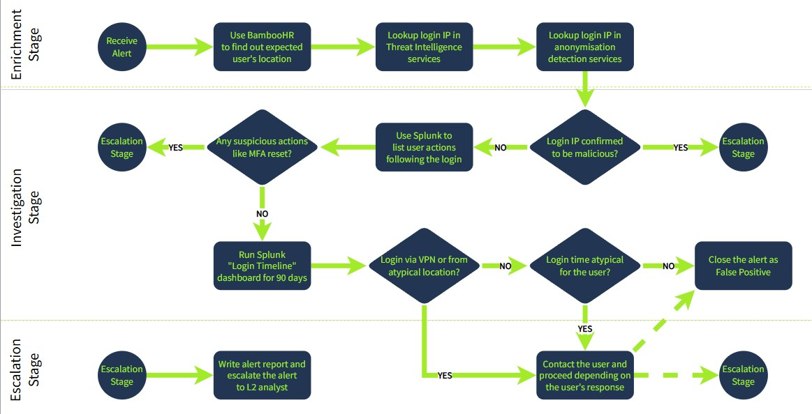

# SOC - Refresher Notes
**Start Date:** 2026-3-04
**Status:** Updatiing
#### Currently getting a feel for the TryHackMe platform via their Cyber Security 101 course, which I plan to finish just for the accomplishment. While my main coursework is happening outside of THM, I would like to use the platform to broaden my form of study, putting a focus on some of their SOC simulation rooms which I found interesting. 
---

## Room: Tutorial (Template/Layout Tester)
**Key Takeaways:**
* Reviewed the difference between Red Team (Offensive)
and Blue Team (Defensive).
* **CIA Triad:**
    * **Confidentiality:** Only authorized people can see data.
    * **Integrity:** Data hasn't been changed.
    * **Availability:** Data is accessible when needed.

---

## Room: [Intro to Logs]


**Objective:** Learn the fundamental structure of system logs and how contextual correlation is used to piece together the full story of a cyber security incident.
o
**Key Cncepts:**
* **Digital Footprints:** Just like tree rings reveal the history of a tree's life and environment, logs are the historical records of a digital system. Every interaction—from authentication attempts and file accesses to network connections and errors—leaves a digital footprint.
* **The Log File:** Because digital interactions happen at lightning speed, these individual footprints are aggregated into log files, which can grow exponentially in size depending on the system's activity level.


* **Anatomy of a Log Entry:** While specific formats vary by system, almost every useful log contains these core components:
    * **Timestamp:** Exactly *when* the event occurred.
    * **Source:** The system or application that generated the log.
    * **Event Type:** *What* kind of action took place.
    * **Details:** Contextual info like the initiating Username, Source IP address, or device User-Agent.

**The Investigation Framework (Contextual Correlation):**
A single log entry in isolation is rarely enough to prove a breach. The true power of logging is unlocked when you aggregate and cross-reference multiple sources (e.g., matching a VPN login IP with a Web Server access log). This allows an analyst to answer the critical questions of an incident.


| Investigation Question | Example Application (SwiftSpend Breach Scenario) |
| :--- | :--- |
| **What happened?** | An adversary accessed the SwiftSpend GitLab instance. |
| **When did it happen?** | Started at 22:10 on Wednesday, September 8th, 2023. |
| **Where did it happen?** | Originated from IP `10.10.133.168` inside the VPN users' segment. |
| **Who is responsible?** | A device using a specific Firefox/Linux User-Agent assigned to that VPN IP. |
| **Were they successful?** | Yes. Web proxy logs confirm they reached the target and maintained access via an uploaded web shell. |
| **What was the result?** | The adversary achieved Remote Code Execution (RCE) and performed post-exploitation activities. |

**Takeaways / Notes:**
* Logs are the absolute foundation of Incident Response. If a system isn't logging correctly—or if an attacker clears the event logs, the defense is flying completely blind.

**Log Types**

* **Objective:** Understand the different types of logs, how their data is formatted, and the industry standards that dictate how they should be generated, stored, and analyzed.
* **Key Concepts:**
  * **Log Types:** The most common categories that cover about 80% of typical use cases.
    * **Application Logs:** Specific app statuses, errors, and warnings.
    * **Audit Logs:** Operational activities crucial for regulatory compliance.
    * **Security Logs:** Logins, permission changes, and firewall activity.
    * **Server Logs:** Broad server-generated logs (system, event, error, access).
    * **System Logs:** Kernel activities, boot sequences, and hardware status.
    * **Network Logs:** Network traffic, connections, and related events.
    * **Database Logs:** Queries and updates within a DB system.
    * **Web Server Logs:** Requests processed by a web server (URLs, response codes).
  * **Log Formats:** Defines how data is structured and delimited within a log file. 
    * **Semi-structured:** Combines structured data with free-form text.
      * *Syslog Format:* Widely adopted protocol for system/network logs.
      * *Windows Event Log (EVTX):* Microsoft's proprietary format.
    * **Structured:** Strict, standardized formats that are highly conducive to parsing and automated analysis.
      * *CSV / TSV:* Field-delimited tabular data.
      * *JSON:* Highly readable and compatible with modern programming languages.
      * *W3C Extended Log Format (ELF):* Customizable, typically used by Microsoft IIS.
      * *XML:* Flexible and customizable markup language.
    * **Unstructured:** Free-form text. Context-rich but poses challenges for systematic parsing.
      * *NCSA Common Log Format (CLF):* Standard web server log for client requests (Apache default).
      * *NCSA Combined Log Format:* Extension of CLF that adds referrer and user agent data (Nginx default).
  * **Log Standards:** Guidelines specifying what to log, how to transmit securely, and retention periods.
    * *CEE (Common Event Expression):* MITRE standard providing a common log structure.
    * *OWASP Logging Cheat Sheet:* Developer guide for secure app logging mechanisms.
    * *Syslog Protocol:* Standard that separates message generation, storage, and analysis.
    * *NIST Special Publication 800-92:* Guide to computer security log management.
    * *Platform Specific:* Azure Monitor Logs, Google Cloud Logging, Oracle Cloud Infrastructure Logging.
* **Tools & Commands:**
  * `cat [filename]` : Linux command used to read and output the contents of standard log files (e.g., `.txt`, `.json`, `.log`).
  * `Get-WinEvent -Path "[path_to_file.evtx]"` : PowerShell command used to read and parse proprietary Windows Event Logs.
* **Key Takeaways:** Understanding the specific format and standard of a log file is critical because it dictates exactly which parsing tools and techniques you need to use for troubleshooting, incident response, and threat hunting.

**Log Collection, Management, and Centralisation**

* **Objective:** Understand the lifecycle of log data—from collection and time synchronization to secure management and centralisation—and perform a practical configuration to route specific logs using `rsyslog`.
* **Key Concepts:**
  * **Log Collection:** The process of aggregating logs from diverse sources (servers, networks, databases, apps).
    * **Time Synchronisation:** Absolutely critical for maintaining an accurate, chronological timeline of events across different systems. Usually achieved using **NTP (Network Time Protocol)**.
    * **Collection Steps:** Identify Sources -> Choose Collector -> Configure Parameters (enable NTP, prioritize events) -> Test Collection.
  * **Log Management:** Ensuring gathered logs are securely stored, systematically organized, and easily retrievable.
    * **Management Steps:** Secure Storage (consider retention periods) -> Organisation (by source/type) -> Regular Backups -> Periodic Review.
  * **Log Centralisation:** Unifying logs into a single system (like Elastic Stack or Splunk) for rapid incident response and in-depth analysis.
    * **Centralisation Steps:** Choose System -> Integrate Sources -> Set Up Real-Time Monitoring & Alerts -> Integrate with Incident Management protocols.
* **Tools & Commands:**
  * `ntpdate pool.ntp.org` : Manually synchronizes a Linux system's time with a public NTP server.
  * `date` : Displays the current system date and time to verify synchronization.
  * `scp` or `rsync` : Command-line utilities used for manual log collection and file transfer if automated remote log forwarding isn't set up.
  * **rsyslog Configuration Commands:**
    * `sudo systemctl status rsyslog` : Checks if the `rsyslog` service is installed and running.
    * `nano /etc/rsyslog.d/98-websrv-02-sshd.conf` : Creates or edits a custom `rsyslog` configuration file (you can also use `vi`, `vim`, or `gedit`).
    * `$FileCreateMode 0644` : An `rsyslog` directive placed inside the `.conf` file to set standard read/write permissions for the newly created log file.
    * `:programname, isequal, "sshd" /var/log/websrv-02/rsyslog_sshd.log` : The specific `rsyslog` rule that filters logs matching the program "sshd" and routes them to a dedicated file.
    * `sudo systemctl restart rsyslog` : Applies the configuration changes by restarting the service.
    * `ssh localhost` : Initiates a local SSH connection. This is a great way to generate immediate test logs to verify your new `rsyslog` routing works.
* **Key Takeaways:** Maintaining time accuracy across all systems via **NTP** is the absolute bedrock of log analysis; without it, tracking an adversary's exact sequence of events is nearly impossible. Mastering tools like `rsyslog` allows you to filter the noise and centralize high-value data (like SSH authentications) for much faster threat hunting.

**Log Storage, Retention, and Deletion**

* **Objective:** Understand where logs are stored, how long they should be kept using different storage tiers, and the best practices for safely deleting them to balance cost, compliance, and security.
* **Key Concepts:**
  * **Log Storage Locations:** Logs can be stored locally, in a centralized repository, or in the cloud. Choosing a location depends on:
    * **Security & Compliance:** Adhering to organizational protocols and industry regulations.
    * **Accessibility & Capacity:** How fast logs need to be searched and the sheer volume of data generated.
    * **Cost & Disaster Recovery:** Budget constraints and ensuring logs survive system failures.
  * **Log Retention (Storage Tiers):** Storage isn't infinite. Organizations balance historical data needs against cost by using tiers:
    * **Hot Storage:** Logs from the past **3-6 months**. Highly accessible with near real-time query speeds.
    * **Warm Storage:** Logs from **6 months to 2 years**. Acts as a data lake; easily accessible but not as immediate as Hot storage.
    * **Cold Storage:** Archived or compressed logs from **2-5 years**. Not easily accessible; mostly used for retroactive analysis or scoping.
  * **Log Deletion:** Must be executed carefully with a well-defined policy.
    * **Purpose:** Maintains a manageable log size, complies with privacy laws (like **GDPR** which requires deleting unnecessary data), and keeps storage costs down.
  * **Best Practices:**
    * Define policies based on both business needs and legal requirements.
    * **Automate** storage, retention, and deletion to ensure consistency and prevent human error.
    * **Encrypt** sensitive logs.
    * Always perform regular **backups**, especially right before a scheduled deletion.

* **Key Takeaways:** A strong logging pipeline categorizes data into Hot, Warm, and Cold tiers to save money while keeping critical, recent logs instantly searchable for incident response. Always automate your retention policies, and never delete without backing up first!

**Log analysis process, tools, and techniques**

**Objective:** Understand the end-to-end log analysis pipeline, the tools used for rapid vs. complex analysis, and the core techniques for deriving actionable insights from raw data.

### The Log Analysis Pipeline
* **Data Sources:** The origin systems or applications configured to log system events or user activities.
* **Parsing:** Breaking down raw log data from various formats into manageable, understandable components.
* **Normalisation:** Standardizing parsed data into a uniform format, allowing you to easily compare logs from entirely different sources.
* **Sorting:** Organizing data by parameters like time, source, or severity for efficient retrieval and pattern identification.
* **Classification:** Categorizing logs (often automated via machine learning) to quickly filter and focus on the most critical events.
* **Enrichment:** Adding external context to logs, such as geographical data, user details, or threat intelligence, to provide a complete picture.
* **Correlation:** Linking related records across different events to detect complex security threats or system issues that would otherwise remain hidden.
* **Visualisation:** Representing large volumes of data graphically (charts, heat maps) to intuitively spot trends and anomalies.
* **Reporting:** Summarizing data into structured formats to support decision-making, management reviews, and compliance audits.

### Log Analysis Techniques
* **Pattern Recognition:** Identifying recurring sequences to establish normal behavior or detect regular threats.
* **Anomaly Detection:** Spotting specific data points that deviate from the expected baseline.
* **Correlation Analysis:** Discovering relationships, causation, and dependencies between different system components (vital for root cause analysis).
* **Timeline Analysis:** Reviewing logs chronologically to understand performance trends and periodic behaviors over time.
* **Machine Learning & AI:** Automating tedious processes like classification and enrichment, and providing predictive insights.
* **Statistical Analysis:** Using mathematical methods like regression analysis to validate assumptions and make data-driven decisions.

### Tools & Commands
* `cat`, `grep`, `sed`, `sort`, `uniq`, `awk`: Default Linux command-line tools used for rapid, ad-hoc log parsing, especially during active incident response.
* `sha256sum`: Linux command used to take the hash of a log file during collection to ensure its integrity and admissibility in a court of law.
* `Get-FileHash`: The Windows PowerShell cmdlet equivalent for hashing files.
* **EZ-Tools:** A suite of Windows-based tools used for rapid parsing and analysis.
* **Splunk / ELK (Elastic Stack):** Enterprise Security Information and Event Management (SIEM) tools used for complex, large-scale log analysis tasks.

### Key Takeaways
Logs are only useful if you can trust them. Proper acquisition is critical—always take a file hash (`sha256sum` or `Get-FileHash`) the moment you collect a log to ensure its integrity and legal admissibility.

---

## Room: [Log Operations]

**Learning Objectives**
* Understanding the logic of log management and configuration
* Familiarise with log configuration approaches
* Experience the log configuration process

**Log Configuration**

**Objective:** Understand the four primary purposes of log configuration—Security, Operational, Legal, and Debug—and how they dictate what data a system should record.


### Security Purposes
* **Focus:** Detecting and responding to anomalies, threat activity, and unauthorized access.
* **Key Areas:** Logging user authentication data, verifying user activity, monitoring system integrity, and ensuring data confidentiality.

### Operational Purposes
* **Focus:** Maintaining system continuity, reliability, and performance.
* **Key Areas:** Troubleshooting system errors, capacity planning, service billing, and proactively generating status reports for system components.

### Legal & Compliance Purposes
* **Focus:** Ensuring the organization adheres to required laws, obligations, and industry standards.
* **Key Frameworks:** ISO 27001, COBIT, GDPR, PCI DSS, HIPAA, FISMA.
* **Example (PCI DSS Logging Compliance):** Requires an active central log management system, a strict 12-month log retention policy (with the most recent 3 months immediately searchable), and yearly audit checks.

### Debug Purposes
* **Focus:** Enhancing system features and discovering potential bugs or fault conditions.
* **Key Areas:** Usually restricted to testing and development environments (rarely implemented in production). Used to increase application visibility, improve efficiency, and speed up the development process.

### Key Takeaways
Log configuration is never a one-size-fits-all approach. A well-designed logging environment must perfectly balance the immediate need to catch active cyber threats (Security) with the strict, long-term retention requirements of industry regulations (Legal).

**Deciding Logging Purpose**

* **Objective:** Understand how to transition from defining your logging purpose to building an actionable implementation plan through structured team brainstorming.


* **Key Concepts:**
* **The Planning Meeting:** Far from a passive activity, this is the critical first step to get the ball rolling, consider multiple technical aspects, and create your foundational draft plan.
* **Post-Meeting Steps:** Once the initial questions are answered, the team must create a detailed plan, choose specific tools/technologies, and establish the actual monitoring and analysis processes.
* **Strategic Questioning:** Every implementation is unique, but asking standard baseline questions ensures no major operational or security gaps are missed before spending budget on tools.

* **Key Planning Questions to Ask:**
* **Scope & Purpose:** What exact assets will we log, and what is the specific purpose? Are there extra commitments required to achieve this?
* **Data Volume:** How much data are we planning to log versus how much data do we *actually* need to log?
* **Logistics & Analysis:** How are we going to collect the logs, where will they be stored, and how will they be analyzed?
* **Compliance & Security:** Are there specific laws, regulations, or standards we must comply with based on the data we are collecting? How will we protect these logs from tampering?
* **Resources:** Do we realistically have the budget, workforce, and resources necessary to plan, implement, and maintain this logging pipeline?

* **Key Takeaways:** Never jump straight into configuring tools. Always start with a structured brainstorming session to align your team on scope, budget, and compliance requirements so you don't end up collecting useless data or violating privacy laws.

**Configuration Dilemma: Planning and Implementation**

* **Objective:** Understand the challenge of balancing mandatory logging requirements (like basic security and compliance) with the proactive aspirations of threat hunting, all while managing costs and resources.

### The Configuration Dilemma
* **The Core Challenge:** Finding the practical balance between technical requirements, scope, log details, and price (which includes financial costs, manual labor, and infrastructure investments).
* **Key Stakeholders:** A successful log configuration plan requires input from system administrators, legal advisors, financial advisors, and management.
* **Meeting Objective:** Fulfill the non-negotiable operational and security requirements first, *then* evaluate if it is feasible to collect additional data for deeper insights.
* **Risk Assessment:** Conducting a comprehensive risk assessment that prioritizes security, compliance, and legal needs is the best way to navigate this dilemma and justify costs.

### Requirements vs. Aspirations


* **Base Requirements (The "Reactive" Mindset):**
  * Focuses primarily on **Incident Detection**.
  * Crucial for defending against known threats and building a solid logging foundation.
  * **Key Questions Answered:** What happened? When did it happen (timestamps)? Where did it happen (network, path)? Who or what caused it? Which log source reported it?

* **Aspirations for Better Insights (The "Proactive" Mindset):**
  * Focuses primarily on **Threat Hunting**.
  * Crucial for defending against advanced, sophisticated, or zero-day threats.
  * Requires significantly more resources (storage, compute power, and analyst time).
  * **Key Questions Answered:** Can we get more granular details? How accurate is this data? What exactly is affected? What will the adversary do next? What specific actions should we take to remediate?

### Key Takeaways
You must build your baseline first to establish a solid incident detection and response foundation. However, to survive in the modern, ever-evolving threat landscape, your operational vision must eventually expand to include those proactive, resource-heavy threat hunting aspirations.

**Principles and Difficulties**

* **Objective:** Understand the core principles required to build an effective logging pipeline and anticipate the common technical and operational challenges you will face.
* **Key Concepts:**

### Logging Principles
A proper logging operation requires active resource utilization and strict adherence to foundational principles to ensure efficiency.

| Category | Core Principles |
| :--- | :--- |
| **Collection** | Define the logging purpose. Collect only what you need and use. Actively avoid logging irrelevant data (noise). |
| **Format** | Log at the correct level of detail. Implement a consistent format across systems. Ensure timestamps are strictly accurate and synchronized (NTP). |
| **Archiving & Accessibility** | Define and enforce retention policies. Ensure critical logs are readily available for analysis. Always create backups of stored data. |
| **Monitoring & Alerting** | Create alerts *only* for important, noteworthy cases. Focus strictly on actionable alerts to avoid alert fatigue/noise. |
| **Security** | Protect logs with strict access controls. Implement encryption where required. Use dedicated, isolated log management solutions. |
| **Continuous Change** | Understand that log sources and messages constantly evolve. Be open to continuous system changes and actively train your personnel. |

### Logging Challenges
Most log management challenges can be mitigated during the initial planning phase, but you must be prepared to handle the following hurdles.

| Category | Common Challenges |
| :--- | :--- |
| **Data Volume & Noise** | Juggling multiple data sources with varying log volumes. Some apps generate too little data, while others create massive, noisy datasets that obscure actual threats. |
| **System Performance** | Log collection agents can drastically slow down host performance. Managing agent updates across large networks is overwhelming. Legacy ("ancient") systems are often too fragile to touch. |
| **Process & Archive** | Parsing disparate data formats is time-consuming and error-prone. Balancing retention limits against strict compliance regulations is a constant struggle. |
| **Security** | Securing the log data itself from tampering or unauthorized access is a massive undertaking. |
| **Analysis** | Correlating data across multiple sources requires significant computing power and expertise. Achieving this in real-time while avoiding false positives/negatives is highly complex. |
| **Miscellaneous** | Lack of planning, budget, or technical skills. Focusing entirely on *collecting* logs rather than actually *analyzing* them. Ignoring the human factor (burnout, misconfigurations). |

* **Key Takeaways:** You can collect all the data in the world, but if you don't have the compute power, budget, or skilled personnel to actually analyze it, your logging pipeline is useless. Adhere to the principles, anticipate the data volume challenges, and focus on actionable alerts.

---

## Room: [Log Fundamentals]

**Use Cases Of Logs**
* **Security Events Monitoring** - Logs help us detect anomalous behavior when real-time monitoring is used.
* **Incident Investigation and Forensics** - Logs are the traces of every kind of activity. It offers detailed information on what happened during the incident. The security team utilizes the logs to perform root cause analysis of incidents.
* **Troubleshooting** - As the logs also record the errors in systems or applications, they can be used to diagnose issues and helpful in fixing them.
* **Performance Monitoring** - Logs can also provide valuable insights into the performance of applications.
* **Auditing and Compliance** - Logs play a major role in Auditing and Compliance, making it easier with its capability to establish a trail of different kinds of activities.

**Windows Event Viewer Log Analysis**
* **Objective:** Understand the primary Windows event log categories, learn to navigate the built-in Event Viewer utility, and filter logs to track specific security events using critical Event IDs.
* **Key Concepts:**
  * **Core Windows Log Categories:** Windows segregates logs into specific files based on their category.
    * **Application:** Information, errors, warnings, and compatibility issues related to installed software.
    * **System:** OS-level operations, driver issues, hardware status, system startup/shutdown, and background services.
    * **Security:** The most critical log for analysts. Tracks user authentication, account modifications, and security policy changes.
  * **Event Log Fields:** When you double-click a log entry, you see detailed metadata.
    
    * **Description:** Detailed information about the specific activity.
    * **Log Name:** The file where the log is stored.
    * **Logged:** The exact timestamp of the activity.
    * **Event ID:** A unique numerical identifier for a specific type of activity.
  * **Crucial Windows Event IDs:** While you don't need to memorize all of them, these are foundational for tracking user activity and potential compromise:

| Event ID | Description |
| :--- | :--- |
| **4624** | A user account successfully logged in. |
| **4625** | A user account failed to login. |
| **4634** | A user account successfully logged off. |
| **4720** | A user account was created. |
| **4722** | A user account was enabled. |
| **4724** | An attempt was made to reset an account’s password. |
| **4725** | A user account was disabled. |
| **4726** | A user account was deleted. |

* **Tools & Techniques:**
  * **Event Viewer:** The built-in Windows GUI utility used to view and search logs (accessible via the Start Menu).
    
  * **Filter Current Log:** A powerful feature within Event Viewer that allows you to narrow down thousands of events to just the ones you care about. 
    
    * *Technique:* Click 'Filter Current Log' on the right-hand pane, and type a specific ID (e.g., `4624`) into the `<All Event IDs>` field to instantly isolate successful logins.

* **Key Takeaways:** You don't need external parsing tools to start hunting on a Windows machine; the built-in Event Viewer is highly capable. Knowing just a handful of Event IDs (like 4624 and 4625) allows you to quickly filter out noise and spot brute-force attacks or unauthorized access.

**Web Server Access Logs Analysis** 
* **Objective:** Understand the structure of a standard web server access log and use basic Linux command-line utilities to manually parse, filter, and analyze the data.
* **Key Concepts:**
  * **Web Server Access Logs:** Every request made to a website (viewing a page, logging in, uploading a file) is recorded by the web server. 
  * **Default Apache Log Location:** Typically found at `/var/log/apache2/access.log` on Linux systems.
  * **Log Entry Breakdown:** A standard Apache log entry contains several crucial fields:
    * **IP Address:** The IP of the user making the request (e.g., `172.16.0.1`).
    * **Timestamp:** When the request occurred (e.g., `[06/Jun/2024:13:58:44]`).
    * **Request:** Contains the **HTTP Method** (like `GET` or `POST`) and the **URL/Resource** being requested (like `/products`).
    * **Status Code:** The server's response code (e.g., `200` for success, `404` for not found, `500` for server error).
    * **User-Agent:** Metadata about the user's Operating System and browser.


* **Tools & Commands:**
  * `cat [filename]` : Displays the entire contents of a log file in the terminal.
    * *Pro-Tip:* You can combine rotated log files into a single file for easier analysis using: `cat access1.log access2.log > combined_access.log`
  * `grep "[string]" [filename]` : Searches the log file for specific strings or patterns and outputs only the matching lines (e.g., `grep "192.168.1.1" access.log`).
  * `less [filename]` : Opens the log file in a paginated view, allowing you to scroll through massive files without flooding your terminal.
    * **less Navigation Shortcuts:**
      * `Spacebar` : Move forward one page.
      * `b` : Move backward one page.
      * `/pattern` : Type `/` followed by your search term and hit `Enter` to search within the file.
      * `n` : Jump to the *next* occurrence of your search term.
      * `N` : Jump to the *previous* occurrence of your search term.

* **Key Takeaways:** Web logs are incredibly noisy. Mastering `grep` allows you to instantly slice through the noise to track a specific attacker's IP address, while `less` is perfect for carefully reviewing the chronological events immediately before and after an attack.

---

## Room: [Intro to Log Analysis]

**Investigation Theory**

* **Objective:** Learn the core methodologies for conducting log analysis investigations, including timeline creation, data visualization, alerting, and incorporating threat intelligence.
* **Key Concepts:**
  * **Timelines:** A chronological sequence of logged events. Crucial for reconstructing security incidents, identifying the initial point of compromise, and tracking an attacker's Tactics, Techniques, and Procedures (TTPs).
    
  * **Timestamps & Timezones:** Logs from distributed systems often have completely different time zones and formats.
    * Modern SIEMs (like Splunk) automatically convert timestamps to a universal standard (UNIX time) during indexing, storing it in a unified `_time` field, and then displaying it in your local timezone for analysis.
  * **Super Timelines:** A consolidated, holistic view combining logs from multiple disparate sources (system, network, application, firewall) into a single chronological timeline to reveal hidden correlations.
  * **Data Visualization:** Using tools like **Kibana** (Elastic Stack) or **Splunk** to convert raw log data into interactive charts and graphs.
    * *Goal:* Create a tailored dashboard acting as a "single pane of glass" to easily spot anomalies (e.g., a line chart tracking failed logins over 7 days).
    
  * **Log Monitoring & Alerting:** Proactively configuring SIEM solutions to trigger automated alerts based on specific metrics (e.g., privilege escalation, access to sensitive files). This requires predefined escalation procedures so the right personnel are notified.
  * **Threat Intelligence:** Identifying known malicious artifacts to actively search for within your logs.
    * *Examples of Threat Intel:* IP Addresses, File Hashes, Domains.
    * *Resources:* Threat intel feeds like **ThreatFox**.

* **Tools & Commands:**
  * **Plaso (Python Log2Timeline):** An open-source digital forensics tool designed to automate the parsing and creation of super timelines from a wide range of log sources.
  * `cat access.log` : Outputs the contents of the web server access log to the terminal to begin manual review.
  * `grep "54.36.149.64" logfile.txt` : Searches a log file for a specific Threat Intelligence indicator (like a known malicious IP address) to see if that specific attacker accessed your systems.

* **Key Takeaways:** You can't analyze a log if you don't know what you are looking for. By combining normalized timestamps, super timelines, and external Threat Intelligence feeds, you can reconstruct an attacker's exact path through your network from start to finish.

**Detection Engineering**

* **Objective:** Learn where critical logs are stored by default on Linux systems and how to identify common attack signatures and abnormal user behaviors within those files.

### Common Log File Locations
While actual paths can vary based on custom configurations, these are the standard default locations for major services:

* **Web Servers:**
  * **Nginx:** `/var/log/nginx/access.log` and `/var/log/nginx/error.log`
  * **Apache:** `/var/log/apache2/access.log` and `/var/log/apache2/error.log`
* **Databases:**
  * **MySQL:** `/var/log/mysql/error.log`
  * **PostgreSQL:** `/var/log/postgresql/postgresql-{version}-main.log`
* **Operating Systems & Web Apps:**
  * **Linux General:** `/var/log/syslog`
  * **Linux Authentication:** `/var/log/auth.log`
  * **PHP:** `/var/log/php/error.log`
* **Firewalls and IDS/IPS:**
  * **iptables:** `/var/log/iptables.log`
  * **Snort:** `/var/log/snort/`

### Detecting Abnormal User Behavior
To spot an attacker, you must first baseline what "normal" user behavior looks like. Look for these common deviations:
* **Brute-Force Indicators:** Multiple failed login attempts in a short timeframe.
* **Unauthorized Access:** Logins occurring outside typical access hours or from anomalous geographic locations (impossible travel).
* **Account Takeover Evasion:** Frequent password changes in a short period.
* **Malicious User-Agents:** Requests containing uncommon User-Agent strings. For example, automated scanners like **Nmap** log "Nmap Scripting Engine", and brute-forcers like **Hydra** log "(Hydra)".

### Common Attack Signatures
Identifying web-based attacks requires looking for specific, often malformed, characters in application or database logs.
* **SQL Injection (SQLi):** Attempts to exploit database interactions. Look for unexpected characters like single quotes (`'`), comments (`--`, `#`), or commands like `UNION` and `SLEEP()`.
  * *Example Payload:* `GET /products.php?q=books' UNION SELECT null, null, username, password, null FROM users--`
* **Cross-Site Scripting (XSS):** Attempts to inject malicious scripts into web pages. Look for unexpected input containing script tags (`<script>`) or event handlers (`onmouseover`, `onclick`, `onerror`).
  * *Example Payload:* `GET /products.php?search=<script>alert(1);</script>`
* **Path / Directory Traversal:** Attempts to access files outside the intended web directory. Look for sequence characters (`../`) and sensitive OS files (`/etc/passwd`). 
  
  * *Example Payload:* `GET /../../../../../etc/passwd`
  * *Important Note:* Attackers often use URL encoding to bypass firewalls. Remember that `%2E` is a dot (`.`) and `%2F` is a forward slash (`/`). 

### Tools & Platforms
* **User Behavior Analytics (UBA):** Solutions like Splunk UBA, IBM QRadar UBA, and Azure AD Identity Protection use machine learning to automatically establish baselines and alert on anomalous behavior.

### Key Takeaways
Attackers know that defensive tools look for plain-text attack signatures. Always check your logs for URL-encoded payloads (like `%2E%2E%2F` instead of `../`) when hunting for directory traversals or SQL injections!

**Command Line**

* **Objective:** Learn how to chain built-in Linux command-line tools together to rapidly view, parse, filter, and manipulate log data without needing a dedicated SIEM.

### 1. Viewing Log Files
These tools are your starting point for getting log data onto your screen.

| Command | Purpose | Common Flags & Usage |
| :--- | :--- | :--- |
| `cat` | Prints the entire log file to the terminal. | `cat apache.log` (Not recommended for massive files). |
| `less` | Opens large files page-by-page. | `less apache.log` (Use arrows to scroll, press `q` to quit). |
| `head` | Displays the *first* 10 lines by default. | `head -n 5 apache.log` (Shows only the first 5 lines). |
| `tail` | Displays the *last* 10 lines by default. | `tail -f -n 5 apache.log` (Shows last 5 lines and *follows* new entries in real-time). |


### 2. Extracting and Sorting Data
These commands are essential for pulling specific columns (like IP addresses) and organizing them to spot trends.

| Command | Purpose | Common Flags & Usage |
| :--- | :--- | :--- |
| `wc` | Word count. Outputs line, word, and character counts. | `wc apache.log` (Helps gauge the size of the dataset). |
| `cut` | Extracts specific columns (fields) based on a delimiter. | `cut -d ' ' -f 1 apache.log` (Uses a space delimiter to grab the 1st field—usually the IP address). |
| `sort` | Arranges data chronologically, alphabetically, or numerically. | `sort -n` (Sort numerically) <br> `sort -n -r` (Sort numerically in reverse). |
| `uniq` | Removes adjacent duplicate lines. *Must be used on sorted data!* | `uniq` (Removes duplicates) <br> `uniq -c` (Prepends the count of occurrences to spot high-volume IPs). |

* **Pro-Tip (The Analyst Pipeline):** You will almost always chain these commands together using the pipe (`|`) operator. 
  * *Example (Get a count of unique IP addresses from highest to lowest):* `cut -d ' ' -f 1 apache.log | sort -n | uniq -c | sort -n -r`


### 3. Modifying and Advanced Filtering
For advanced manipulation or numerical conditions.

| Command | Purpose | Common Flags & Usage |
| :--- | :--- | :--- |
| `sed` | Stream editor used to find and replace text. | `sed 's/31\/Jul\/2023/July 31, 2023/g' apache.log` (Replaces date formatting. *Warning: using the `-i` flag overwrites the file!*). |
| `awk` | Text processing tool excellent for conditional actions. | `awk '$9 >= 400' apache.log` (Prints only lines where the 9th field—the HTTP status code—is 400 or greater). |

### 4. Searching for Signatures
The most important command for finding specific threat intelligence indicators.

| Command | Purpose | Common Flags & Usage |
| :--- | :--- | :--- |
| `grep` | Searches files for specific strings or regular expressions. | `grep "admin" apache.log` (Finds any mention of "admin"). |
| `grep -c` | Counts the number of matching lines. | `grep -c "admin" apache.log` (Returns the total hits). |
| `grep -n` | Prepends the line number to the output. | `grep -n "admin" apache.log` (Helps locate the event in the raw file). |
| `grep -v` | Invert match. Filters *out* the specified keyword. | `grep -v "/index.php" apache.log` (Removes standard homepage traffic from your view to reduce noise). |

### Key Takeaways
While SIEMs like Splunk are great for dashboards, the Linux command line is often the fastest way to slice through raw logs during an active incident. Mastering the pipe (`|`) to pass data from `cut` to `sort` to `uniq` is a fundamental skill for any security analyst.

**Regex in Log Analysis**

* **Objective:** Learn how to leverage Regular Expressions (Regex) to search for complex patterns using `grep`, extract specific fields from raw logs, and build custom parsing pipelines in Logstash.

### Key Concepts
* **Regular Expressions (Regex):** A sequence of special characters that define a specific search pattern, used for finding, matching, and manipulating text data.
* **Log Parsing:** The process of breaking down raw, unstructured log entries into structured, actionable components (like extracting just the IP, timestamp, or HTTP method) so they can be ingested and queried easily by a SIEM.
* **Grok:** A powerful Logstash plugin that parses unstructured log data into structured formats. It combines text patterns with a specific syntax (`%{SYNTAX:SEMANTIC}`) and allows for custom Regex using the Oniguruma syntax.

### Regex IPv4 Extraction Breakdown
To extract a standard IPv4 address from a raw log, you need a pattern that accounts for four sets of numbers separated by periods.


| Pattern Segment | Explanation |
| :--- | :--- |
| `\b` | Word boundary anchor. Ensures we match the complete IP address and not a subset of a longer string. |
| `[0-9]{1,3}` | Matches one to three digits (numbers from 0 to 999). |
| `\.` | Escapes the dot character, treating it as a literal period rather than a wildcard. |
| `{3}` | Specifies that the preceding group `([0-9]{1,3}\.)` must repeat exactly three times. |
| `[0-9]{1,3}` | Matches the final one to three digits (the fourth octet of the IP). |
| `\b` | Closing word boundary anchor. |

*Full Pattern:* `\b([0-9]{1,3}\.){3}[0-9]{1,3}\b`

### Tools & Commands
* `grep -E '[pattern]' [filename]` : The `-E` flag enables Extended Regular Expressions in `grep`.
  * *Example:* `grep -E 'post=1[0-9]' apache-ex2.log` (Finds any blog post ID from 10 to 19).
* **RegExr:** An excellent online tool for building, testing, and troubleshooting your regex patterns against sample log data.

### Logstash Grok Example
If Logstash lacks a built-in pattern for a custom application log, you can define your own using Regex within the `logstash.conf` file.


> **Example filter configuration:**
> ```conf
> filter {
>   grok {
>     match => { "message" => "(?<ipv4_address>\b([0-9]{1,3}\.){3}[0-9]{1,3}\b)" }
>   }
> }
> ```
> *Note:* The syntax `(?<field_name>pattern)` captures the matched regex and assigns it to a custom field named `ipv4_address` before sending it to the SIEM.

### Key Takeaways
Regex is the ultimate cheat code for log analysis. Whether you are quickly carving out specific data blocks in the terminal with `grep -E`, or writing custom SIEM parsers via Logstash Grok, mastering regex will save you countless hours of manual review.

---

## Room: [Cyber Kill Chain]

**Introduction**

* 1. **Reconnaissance:** In the first stage, the attacker gathers information about the target
* 2. **Weaponisation:** Once proper reconnaissance is conducted, the attacker creates a deliverable payload or modifies an existing one based on the target system's vulnerabilities.
* 3. **Delivery:** Once ready, the attacker sends the weaponised payload to the target
* 4. **Exploitation:** Once executed, the payload exploits a vulnerability in the target’s system
* 5. **Installation:** The exploitation enables the attacker to install a backdoor or malware to maintain persistence in the target’s environment
* 6. **Command & Control (C2):** Using the installed backdoor, the attacker can control the compromised system
* 7. **Actions on Objectives:** Reaching this far, the attacker can now carry out further actions such as data exfiltration or other systems’ exploitation

# **Reconnaissance**

**Key Concepts:**
* **Reconnaissance:** Borrowed from military terminology, this is the act of gathering intelligence about a target before launching an attack. The goal is to map out the target's digital footprint and discover potential entry points or vulnerabilities.
* **Passive vs. Active Reconnaissance:**
  * **Passive:** Gathering information *without* directly interacting with the target's infrastructure. It is stealthy, makes no "noise," and leaves no logs on the target's servers.
  * **Active:** Directly probing the target's systems or personnel. It is noisy, highly likely to be logged, and risks triggering security alerts.


### 1. Examples of Reconnaissance

**Passive Reconnaissance (OSINT - Open Source Intelligence):**
* **WHOIS Lookups:** Checking domain registration databases to find contact names, emails, and registration dates.
* **DNS Querying:** Discovering IP addresses of public servers without touching the servers themselves.
* **Web Scraping & Crawling:** Archiving a target's website to analyze offline.
* **Google Dorking:** Using advanced search engine operators to uncover misconfigured sensitive files (like passwords or database backups) indexed by Google.
* **Social Media Recon:** Harvesting employee names, job roles, and technologies used via LinkedIn or Twitter.

**Active Reconnaissance:**
* **Network Port Scanning:** Using tools like Nmap to directly probe the target's IP addresses to see which ports are open and what services are running.
* **Vulnerability Scanning:** Running automated scanners against the target's public-facing infrastructure.
* **Social Engineering:** Calling or emailing employees directly to trick them into revealing information.
* **Physical Reconnaissance:** Visiting the target's physical office to observe security cameras, badge readers, or employee behavior.

### 2. Countermeasures (Defending against Recon)

Defenders cannot completely stop reconnaissance, but they can make it significantly harder and more expensive for the attacker.

* **Minimize Public Exposure:** Limit the technical details shared on corporate websites or employee social media. 
* **WHOIS Privacy:** Purchase privacy add-ons from domain registrars so your administrative names and addresses aren't publicly searchable.
* **Traffic Monitoring & Log Analysis:** Active recon is noisy. Security Operations Center (SOC) teams must actively monitor firewall logs, network traffic, and Intrusion Detection Systems (IDS) to detect the repetitive probing patterns of port and vulnerability scans.

**Takeaways / Notes:**
* As a penetration tester or attacker, the more time you spend in the Passive Reconnaissance phase, the more successful your Active phase will be. Good OSINT drastically reduces the amount of noisy scanning you have to do!

# **Weaponisation**

**Key Concepts:**
* **Weaponization:** The process of coupling an exploit (the tool that breaks into the system) with a payload (the malicious code that executes once inside) into a deliverable package.
* **Evasion & Stealth:** Attackers rarely send raw malware. They use obfuscation and encryption to hide the malicious code from Antivirus (AV) and Intrusion Detection Systems (IDS). 
* **The Trojan Horse:** The payload is often embedded inside seemingly innocent, everyday files like PDFs, Microsoft Word documents, or Excel spreadsheets.


### 1. Examples of Weaponization
Attackers have a variety of methods to build their cyber weapons, ranging from scratch-built scripts to fully automated platforms.

* **Exploit Kits:** Automated, ready-made platforms containing a library of exploits for various software vulnerabilities. They make it incredibly easy for an attacker to package an exploit into an executable or document.
* **Malicious Macros:** One of the most common weaponization techniques. Attackers embed malicious VBA (Visual Basic for Applications) scripts into Microsoft Office documents. If the victim opens the document and clicks "Enable Content," the macro silently executes the payload in the background.
* **Delivery Preparation:** During this phase, the attacker is also setting up the *delivery mechanism*. This could be crafting a convincing phishing email, setting up a spoofed login page, or loading the payload onto a physical USB drive.


### 2. Countermeasures (Defending against Weaponization)
Since weaponization happens entirely on the attacker's own infrastructure, defenders cannot stop the weapon from being *built*. However, they can implement controls to ensure the weapon *fails to detonate* when it arrives.

| Defense Strategy | Actionable Steps |
| :--- | :--- |
| **User Awareness Training** | Train employees to scrutinize email senders, inspect URLs before clicking, and NEVER open unexpected encrypted ZIP files (especially if the email provides the password to bypass email scanners). |
| **Feature Restriction (GPO)** | Use Windows Group Policy to strictly disable Office Macros across the organization, or limit them so only digitally signed, trusted macros can run. |
| **Attack Surface Reduction** | Uninstall unnecessary software, remove unused browser plugins, and disable legacy features. If the vulnerable software isn't on the machine, the exploit will fail. |

**Takeaways / Notes:**
* A perfectly crafted phishing email (Delivery) means nothing if the macro inside the attached Word document is blocked by Group Policy (failed Weaponization/Execution). Defense in Depth is key!

# **Delivery**

**Objective:** Understand the various methods attackers use to transmit their weaponized payloads into a target environment and the defensive countermeasures used to intercept them.

**Key Concepts:**
* **Delivery:** The transmission of the "cyber weapon" (created in the Weaponization phase) to the target. 
* **The Recon Reliance:** Attackers don't guess how to deliver the payload; they use the intelligence gathered during the Reconnaissance phase. If they know a company uses a specific file-sharing platform, they will likely use that platform to deliver the malware.


### 1. Delivery Methods (How the weapon arrives)
Attackers are constantly inventing creative ways to trick users or bypass perimeter defenses.

* **Phishing & Spear Phishing:** * *Phishing:* Broad, generic emails containing malicious links or attachments (e.g., masking an executable as `invoice.pdf.exe`).
    * *Spear Phishing:* Highly targeted emails where the sender's identity is spoofed to look like a trusted colleague, manager, or vendor.

* **Malicious Web Links & Malvertising:** Hosting exploit kits on compromised public websites, or buying ad space on legitimate sites (Malvertising) to redirect unsuspecting visitors to malicious pages. URL shorteners are frequently used to hide the true destination.
* **File-Sharing Platforms:** Uploading malware to trusted cloud providers (like Google Drive or Dropbox) to bypass basic network filters that inherently trust those domains.
* **Smishing (SMS Phishing):** Sending text messages with malicious links, often creating a false sense of urgency (e.g., "Your package delivery failed, click here").
* **Physical Delivery:** * *USB Drops:* Leaving a malware-infected USB drive in the company parking lot or lobby, relying on human curiosity to plug it in.
    * *Mailed Media:* Sending an innocent-looking CD or DVD to an employee with a convincing pretext (e.g., a vendor catalog).

### 2. Countermeasures (Defending the Perimeter)
Defending against delivery requires a mix of technical controls and human intuition. It is an ongoing "cyber arms race."

| Defensive Control | Purpose |
| :--- | :--- |
| **User Awareness Training** | The ultimate line of defense. Training employees to spot phishing, verify URLs, and safely handle unexpected physical media. |
| **Email & Web Filtering** | Automated systems that scan incoming emails for known malicious attachments or block employee access to known bad domains. |
| **Web Application Firewalls (WAF)** | Specialized firewalls that monitor and block malicious HTTP traffic and files attempting to enter via web services. |
| **Endpoint & Network Monitoring** | Watching internal network traffic for the exact moment a delivered payload attempts to execute or phone home. |

**Takeaways / Notes:**
* Delivery is unique because it is the phase where the attacker relies most heavily on **human error**. No matter how expensive a company's firewalls are, a single employee clicking a malicious link can bypass them entirely. Building a "Human Firewall" is just as important as configuring the technical one!

# **Exploitation**

**Key Concepts:**
* **Exploitation:** The moment the attacker's weapon successfully triggers a flaw in the target's operating system, application, or human psychology to gain unauthorized access.
* **Zero-Day Exploit:** A highly dangerous scenario where an attacker discovers and exploits a software vulnerability *before* the software vendor even knows it exists (meaning there is zero days of notice and no patch available).


### 1. Methods of Exploitation (The Breach)
Exploitation isn't always a complex, movie-style hacking sequence. Very often, it's just walking through an unlocked digital door.

* **Authentication Attacks:**
    * *Weak/Default Passwords:* Exploiting systems that were left with factory default credentials (like `admin`/`admin`) or easily guessable passwords.
    * *Credential Theft:* Tricking the user into handing over their password via a spoofed login page (following a successful Delivery).
* **Software Vulnerabilities:**
    * Triggering known flaws in unpatched operating systems or applications. 
    * *Buffer Overflows:* Sending too much data to an application to crash it and execute arbitrary code.
* **Web Application Attacks:**
    * *SQL Injection (SQLi):* Tricking a database into executing malicious commands to bypass logins or dump data.
    * *Cross-Site Scripting (XSS) & CSRF:* Exploiting vulnerabilities in how a web app handles user input to hijack sessions.


### 2. Countermeasures (Defeating the Exploit)
Since attackers only need to find *one* vulnerability, defenders must use a "Defense in Depth" strategy to layer their protections.

| Defensive Control | Purpose & Application |
| :--- | :--- |
| **Multi-Factor Authentication (MFA)** | The absolute best defense against authentication attacks. Even if the attacker successfully spear-phishes a user's password, the exploit fails because they do not have the secondary token. |
| **Patch Management & Vuln Scanning** | Continuously updating servers and clients. Vulnerability scanners (like Nessus or OpenVAS) help identify what needs patching before an attacker exploits it. |
| **Intrusion Prevention Systems (IPS)** | Unlike an IDS that only alerts, an IPS sits inline and actively drops network packets that match the signatures of known software exploits. |
| **Web Application Firewalls (WAF)** | Specifically designed to inspect HTTP/HTTPS traffic. A WAF will instantly block exploitation attempts like SQL Injection or XSS before they reach the web server. |

**Takeaways / Notes:**
* **Exploitation vs. Execution:** Sometimes these concepts blur together. *Exploitation* is the method of getting in (e.g., using a buffer overflow), while *Execution* (often the next step) is what the malware actually does once the exploit succeeds.

# **Installation**

**Key Concepts:**
* **The Goal is Persistence:** Exploitation is often noisy and risky. Once an attacker gets in, they want to make sure they *stay* in. The Installation phase is all about planting backdoors so the attacker has a quiet, reliable way back into the network.
* **Living off the Land (LOLBins):** Advanced attackers try to avoid dropping custom malware that an Antivirus might catch. Instead, they use legitimate, built-in administrative tools (like PowerShell, WMI, or native scripting engines) to maintain their access.


### 1. Methods of Installation (Digging In)
Attackers use a variety of OS-level features to ensure their malicious code runs automatically.

* **Scheduled Tasks & Cron Jobs:** Creating hidden tasks in Windows (Task Scheduler) or Linux (`cron`) that automatically execute the attacker's payload at specific times or upon system boot.
* **Service/Daemon Creation:** Installing a rogue background service that runs silently with SYSTEM or root privileges.
* **Startup Scripts & Registry Keys:** Modifying the Windows Registry (e.g., the `Run` or `RunOnce` keys) or Linux `.bashrc` files to trigger the backdoor whenever a user logs in.
* **Web Shells:** If the compromised target is a web server, the attacker will upload a small script (written in PHP, ASP, etc.). This provides a hidden interface accessible via a standard web browser, allowing the attacker to run OS commands disguised as normal, encrypted HTTPS web traffic.


### 2. Countermeasures (Rooting Them Out)
Detecting persistence requires deep visibility into what the endpoints (workstations and servers) are actually doing day-to-day.

| Defensive Control | Purpose & Application |
| :--- | :--- |
| **Endpoint Detection and Response (EDR)** | EDR tools (like CrowdStrike or SentinelOne) record low-level endpoint activity. They alert analysts to unusual parent-child process relationships (e.g., Microsoft Word spawning a PowerShell command) or strange file modifications. |
| **System Auditing & Baselines** | Regularly comparing the current state of a system against a known "secure baseline." This helps identify unauthorized changes, like newly created hidden local admin accounts or weird background services. |
| **Application Allowlisting** | A strict policy where *only* explicitly approved applications are allowed to execute. If a binary or script isn't on the list, the OS blocks it from running entirely. |
| **Process Monitoring** | Actively watching for known LOLBins being used in strange contexts or making unexpected external network connections. |

**Takeaways / Notes:**
* Finding an attacker's persistence mechanism is critical during Incident Response. If you find the web shell but miss the scheduled task they also created, the attacker will just log right back in the next day!

# **Command and Control (C2)**

**Key Concepts:**
* **Command and Control (C2 / C&C):** After successfully installing a backdoor (Persistence), the malware needs a way to phone home to receive instructions and exfiltrate data. The C2 phase is the establishment of this remote control channel.
* **Evasion (Blending In):** Attackers know that security teams watch outbound network traffic closely. Therefore, C2 traffic is intentionally designed to look like normal, everyday internet noise.


### 1. Methods of C2 Communication (Hiding in Plain Sight)
Attackers use standard protocols and trusted platforms so their traffic doesn't get automatically blocked by perimeter firewalls.

* **Standard Application Protocols:** Using HTTP/HTTPS to make the malware's check-ins look like a user browsing the web. 
* **DNS Tunneling:** A highly stealthy technique where the attacker encodes C2 commands and stolen data directly inside Domain Name System (DNS) queries and responses. Since almost all networks allow outbound DNS traffic to resolve websites, this often bypasses firewalls entirely.

* **Legitimate Cloud Services:** Using APIs for services like Twitter (X), Slack, Google Drive, or Dropbox to issue commands and receive data. Because the destination IP belongs to a trusted company, standard network filters usually allow the traffic.

### 2. C2 Resilience (Surviving Takedowns)
If an attacker hardcodes a single IP address or domain into their malware, defenders can easily block it, severing the C2 channel. Attackers use automated techniques to prevent this.

| Technique | How it Works | The Goal |
| :--- | :--- | :--- |
| **DGA (Domain Generation Algorithms)** | The malware mathematically generates thousands of random domain names daily (e.g., `xkq92jdn.com`). The attacker only registers a few of them. The malware constantly cycles through the list until it finds the active one. | If defenders block one domain, the malware simply shifts to the next one on its generated list. |
| **Fast Flux** | Associates hundreds of compromised IP addresses (often IoT devices) with a *single* domain name, swapping the active IP addresses every few minutes via DNS records. | Acts as a constantly shifting proxy network. If defenders block one IP, another takes its place instantly to forward traffic to the hidden C2 server. |


### 3. Countermeasures (Hunting the Beacon)
Catching C2 traffic requires looking for anomalies in the baseline of normal network activity.

* **Network Traffic Analysis (NTA):** Using IDS/IPS to watch for unusual traffic volumes, rhythmic "beaconing" patterns (e.g., a host making a small connection to an external IP exactly every 60 seconds), or connections to known bad IPs.
* **DNS Analysis:** Monitoring for unusually long DNS queries (a strong indicator of DNS tunneling) or a massive volume of requests to random, nonsensical domains (an indicator of DGA).
* **SSL/TLS Inspection:** Since attackers use HTTPS to encrypt their C2 traffic, organizations must deploy SSL Decryption (often via a Next-Generation Firewall or Proxy) to crack open the traffic and inspect the payload for malicious commands.
* **Honeypots:** Deploying intentionally vulnerable decoy systems on the network. If a honeypot suddenly tries to establish an outbound connection, you know immediately that an attacker is trying to set up a C2 channel.

**Takeaways / Notes:**
* **Beaconing** is the telltale sign of C2. Malware will usually "sleep" and only wake up periodically to ask the C2 server, "Do you have any new commands for me?" Spotting this heartbeat in the network logs is a core skill for SOC analysts!

# **Actions on Objectives Phase**

**Key Concepts:**
* **Actions on Objectives:** This is the culmination of the entire cyber attack lifecycle. The attacker stops preparing and starts executing their primary mission. 
* **The Motive Dictates the Action:** How "noisy" this phase is depends entirely on the attacker's goal. A nation-state stealing secrets will remain incredibly quiet, whereas a financially motivated cartel dropping ransomware will intentionally make themselves known.


### 1. Attacker Goals (The Execution)
Once Command and Control (C2) is established, the attacker can pivot to their endgame:

* **Data Exfiltration (Espionage/Theft):** Silently copying and transferring sensitive corporate data, customer records, or intellectual property out of the network to an attacker-controlled server.
* **Financial Gain (Ransomware & Fraud):** Encrypting the organization's critical files and demanding cryptocurrency for the decryption key. Alternatively, quietly executing unauthorized wire transfers.
* **Service Disruption (Destruction):** Intentionally deleting or corrupting data to halt business operations. In highly specialized attacks, this can involve manipulating Industrial Control Systems (ICS) to cause physical damage (e.g., shutting down a power grid).
* **Lateral Movement:** Using the initially compromised machine as a beachhead to stealthily scan and compromise *other* sensitive servers deeper inside the corporate network.

### 2. Countermeasures (Limiting the Blast Radius)
If an attacker reaches this phase, perimeter defenses have failed. The focus shifts to containment, damage control, and recovery.


| Defensive Control | Purpose & Application |
| :--- | :--- |
| **Data Loss Prevention (DLP)** | Software that monitors outbound network traffic and blocks sensitive files (like credit card numbers or classified documents) from leaving the corporate boundary. |
| **Network Segmentation & Access Controls** | Dividing the network into isolated zones. If an attacker compromises a receptionist's PC, strict access controls and segmentation prevent them from moving laterally to the Domain Controller or Database servers. |
| **Backups & Disaster Recovery** | The ultimate defense against ransomware and destructive attacks. Maintaining offline, immutable backups ensures the organization can wipe the infected systems and restore operations without paying a ransom. |
| **EDR & User Activity Monitoring** | Watching for highly anomalous behavior, such as a standard user account suddenly zipping up 50GB of files or making DNS queries at 3:00 AM. |

**Takeaways / Notes:**
* **The Principle of Least Privilege (PoLP)** is a defender's best friend here. If an employee's compromised account doesn't have the administrative rights to access the financial database, the attacker's job becomes significantly harder, forcing them to spend more time attempting Privilege Escalation (which increases their chances of getting caught!).

---

## Room: [MITRE]

**MITRE:** MITRE is a not-for-profit organization that conducts research and development across a range of domains, including cyber security, artificial intelligence, healthcare, and space systems, all to support its mission: "to solve problems for a safer world." / MITRE Adversarial Tactics, Techniques, and Common Knowledge (ATT&CK)

## **Introduction to the MITRE ATT&CK Framework**

**Key Concepts:**
* **What is MITRE ATT&CK?** It stands for Adversarial Tactics, Techniques, and Common Knowledge. It is a globally accessible, continuously updated encyclopedia of real-world hacker behaviors. 
* **The Core Language (TTPs):** Cybersecurity professionals use "TTPs" to describe how threat actors operate. 
    * **Tactic (The "Why"):** The adversary's overarching goal (e.g., *Reconnaissance*, *Privilege Escalation*, or *Exfiltration*).
    * **Technique (The "How"):** The method the adversary uses to achieve that goal (e.g., *Active Scanning* or *Phishing*).
    * **Procedure (The "Implementation"):** The exact, specific way the technique is executed, often detailing the specific software or malware used (e.g., *Using Nmap to scan IP blocks*).


### 1. The ATT&CK Matrix
The framework is visualized as a massive matrix (often explored using the ATT&CK Navigator tool). 
* **Layout:** The *Tactics* (Goals) run across the top as columns. The *Techniques* (Methods) are listed underneath their respective Tactics. Many Techniques also expand into highly specific *Sub-techniques*.

**Example Breakdown (The Reconnaissance Phase):**
Let's map out how an attacker gathering information fits into the framework:
* **Tactic:** Reconnaissance *(The Goal: Gather info on the target)*
* **Technique:** Active Scanning *(The Method: Directly probing the target)*
* **Sub-techniques:** * Scanning IP Blocks
    * Vulnerability Scanning
    * Wordlist Scanning

### 2. Evolution and Application
* **Scope:** Originally focused just on Windows, the Enterprise Matrix now covers macOS, Linux, and Cloud environments. There are also entirely separate matrices for Mobile devices and Industrial Control Systems (ICS).
* **Usage:** * *Blue Teams:* Use it to build defenses, map out their detection coverage, and understand how to mitigate specific behaviors.
    * *Red Teams:* Use it to plan realistic attack simulations that mimic known Advanced Persistent Threat (APT) groups.

**Takeaways / Notes:**
* The MITRE ATT&CK website is a goldmine. If you click on any specific Technique (like *Active Scanning*), the page doesn't just describe the attack—it gives you real-world examples of hacker groups who use it, exactly how to detect it in your logs, and how to mitigate it!

## **ATT&CK in Operation**

**Key Concepts:**
* **The "Rosetta Stone" of Security:** Before ATT&CK, different security vendors and analysts would call the exact same cyber attack by completely different names. MITRE provides a standardized, consistent language and unique IDs (e.g., `T1566` for Phishing) so the entire global community can communicate effectively.
* **Actionable Threat Intelligence:** Reading a report that says "The attacker hacked the server" isn't helpful. ATT&CK bridges the gap by translating *what* the attacker did into *how* they did it (TTPs), allowing defenders to write specific SIEM detection rules to catch those exact behaviors in the future.

### 1. Who Uses ATT&CK?
The framework is universally used across the security industry, but different teams use it to achieve different goals.

| Team / Role | Their Goal | How They Use ATT&CK |
| :--- | :--- | :--- |
| **Cyber Threat Intelligence (CTI)** | Collect & analyze threat info to improve security posture. | Map observed threat actor behavior to ATT&CK TTPs to create industry-wide profiles. |
| **SOC Analysts** | Investigate and triage daily security alerts. | Link alerts to specific Tactics/Techniques to understand the context and prioritize critical incidents. |
| **Detection Engineers** | Design and improve automated detection systems. | Map SIEM, EDR, and firewall rules directly to ATT&CK techniques to ensure there are no "blind spots" in their defenses. |
| **Incident Responders (IR)** | Respond to and investigate active breaches. | Map the incident timeline to MITRE TTPs to visualize exactly how the attack unfolded. |
| **Red & Purple Teams** | Emulate adversary behavior to test defenses. | Build attack simulation plans that perfectly mirror the TTPs of known threat groups. |


### 2. Mapping in Action: Mustang Panda (G0129)
After an incident, teams must map out the attack to prepare for the future. Let's look at the known profile of **Mustang Panda**, an APT (Advanced Persistent Threat) group known for targeting government entities and NGOs.

By looking at their ATT&CK profile, we can map their standard campaign:
1. **Initial Access:** They prefer *Phishing* techniques to gain entry.
2. **Persistence:** They maintain access by creating *Scheduled Tasks*.
3. **Defense Evasion:** They *Obfuscate Files* to hide their malware from Antivirus.
4. **Command and Control (C2):** They use *Ingress Tool Transfer* to pull down additional tools from their external servers.


**Takeaways / Notes:**
* If your organization is frequently targeted by groups like Mustang Panda, your Detection Engineers shouldn't waste time building rules for attacks Mustang Panda *doesn't* use. Instead, they should look at the ATT&CK profile and hyper-focus on building defenses against Phishing, Scheduled Tasks, and File Obfuscation!

## **Cyber Analytics Repository (CAR)**

**Key Concepts:**
* **What is MITRE CAR?** A massive, open-source knowledge base of detection analytics. While ATT&CK tells you that an attacker might use a "Scheduled Task" for persistence, CAR gives you the actual, validated logic to detect that scheduled task being created on your network.
* **The Bridge to Defense:** Threat intelligence is useless if you can't act on it. CAR translates theoretical TTPs (Tactics, Techniques, and Procedures) into practical, ready-to-use queries for Security Information and Event Management (SIEM) platforms.


### Anatomy of a CAR Analytic 
Let's look at the structure of a typical CAR entry (e.g., *CAR-2020-09-001: Scheduled Task - File Access*):

1. **Description:** A plain-English explanation of the adversary behavior being targeted and the operating theory behind *why* this specific analytic catches it.
2. **ATT&CK Mapping:** Direct links to the specific Tactics and Techniques this analytic detects (e.g., mapping back to T1053 - Scheduled Task/Job).
3. **Implementations (The Code):** This is the most valuable section for a SOC analyst. It provides the actual code/logic to run in your security tools.
    * **Pseudocode:** A human-readable, generic description of the logic (e.g., `IF process == 'schtasks.exe' AND action == 'create' THEN alert`). This allows analysts to translate the rule into *any* tool.
    * **Tool-Specific Queries:** Pre-written queries for industry-standard tools like **Splunk**, **EQL** (Elastic Query Language), or **LogPoint**.
4. **Unit Tests:** Some analytics include specific commands an analyst can run safely on a test machine to purposefully trigger the rule. This helps verify that the SIEM is actually ingesting the logs correctly and that the rule works as intended.

### CAR and the ATT&CK Navigator
Just like APT groups have their own matrix profiles, CAR has its own **ATT&CK Navigator layer**. 
* Defenders can load this layer to visually see exactly which ATT&CK techniques currently have a corresponding CAR detection rule written for them, instantly highlighting their network's defensive coverage (and their blind spots!).

**Takeaways / Notes:**
* **Pseudocode is King:** Even if your organization uses a niche SIEM that CAR doesn't have a pre-written query for, the provided pseudocode gives your Detection Engineers the exact logic they need to write it themselves.

## **MITRE D3FEND Framework**

* **D3FEND (Detection, Denial, and Disruption Framework Empowering Network Defense)** is a structured framework that maps out defensive techniques and establishes a common language for describing how security controls work. D3FEND comes with its own matrix which is broken down into seven tactics, each with its associated techniques and IDs.

## **Additional MITRE Projects** 

**Key Concepts:**
Understanding the TTPs of an attacker is only half the battle; the other half is actually testing your network to see if your defenses hold up against those specific techniques. MITRE provides several tools to help automate and standardize this testing.

### 1. Adversary Emulation (Testing the Defenses)
Instead of guessing if you are protected against a group like Mustang Panda, you can actively simulate their exact attack paths on your network.

* **Adversary Emulation Library:** Maintained by the Center for Threat-Informed Defense (CTID), this is a free library of step-by-step "playbooks." These plans provide Red Teams with the exact instructions needed to safely mimic the real-world campaigns of specific APT groups.
* **Caldera:** * **What it is:** An automated adversary emulation platform. 
    * **How it works:** You install Caldera agents on test machines, and the Caldera server automatically executes ATT&CK techniques against them. 
    * **The Value:** It saves Red Teams massive amounts of time and allows Blue Teams to safely generate malicious traffic on demand so they can test if their SIEM alerts actually fire.


### 2. Emerging Frameworks (The Future of Threat Modeling)
As technology evolves, the standard Enterprise ATT&CK matrix isn't always enough. MITRE is constantly developing new, specialized matrices to map out attacks against bleeding-edge systems.

| Framework | Target Environment | What it Covers |
| :--- | :--- | :--- |
| **AADAPT** <br>*(Adversarial Actions in Digital Asset Payment Technologies)* | Web3, Cryptocurrency, & Digital Finance | Tactics and techniques specifically targeting blockchain networks, smart contracts, and digital wallets. |
| **ATLAS** <br>*(Adversarial Threat Landscape for Artificial-Intelligence Systems)* | AI and Machine Learning Models | Real-world vulnerabilities in AI systems, such as data poisoning, model evasion, and manipulating training data. |


**Takeaways / Notes:**
* If you are looking to get into Red Teaming, **Caldera** is an incredibly powerful (and free!) tool to set up in a home lab. It allows you to see exactly what advanced attacks look like under the hood without having to write the malware from scratch.

---

## Room: [Humans as Attack Vectors]

**Social Engineering**

* **Core Concept:** Social engineering is the art of manipulating human psychology rather than exploiting technical system flaws. Attackers succeed by appearing trustworthy and triggering strong emotions (like fear, urgency, or curiosity) to trick victims into compromising their own security.

* **Key Findings:** 
  * **Phishing:** The most prevalent attack vector (billions sent daily). Uses deceptive emails and spoofed login pages to steal credentials.
  * **Malware Downloads:** Tricking users into installing malware themselves, often using clever lures like SEO poisoning (ranking fake sites high on Google), fake CAPTCHAs, or malicious QR codes.
  * **Deepfakes:** A rapidly growing threat where attackers use AI to generate highly convincing audio or video of trusted figures (like executives) to authorize massive fraudulent wire transfers.
  * **Impersonation:** Classic pretexting, often over the phone (Vishing), where attackers pose as authoritative figures like Corporate IT to convince users to grant them system access.
  * **Physical & Alternate Vectors:** Leaving malicious flash drives in parking lots (USB drops), tailgating into buildings, insider threats, and even posting fake job offers.

* **Takeaways:** The human element is almost always the weakest link in any security posture. As a defender or SOC analyst, understanding the psychological manipulation behind these attacks is just as crucial as understanding the technical indicators of compromise.

**Defending Humans**

* **Core Concept:** Defending an organization involves two primary pillars: **Mitigation** (preventing or reducing the impact of attacks) and **Detection** (identifying and investigating the advanced threats that inevitably bypass mitigations). 

* **Key Findings:** 
* **The SOC Analyst Role:** While a SOC analyst's primary job is *Detection*, advocating for strong *Mitigation* measures is critical to reduce alert fatigue and automate the defense against common threats.
  * **Key Mitigation Strategies:**
    * **Anti-phishing Solutions:** Automated tools that filter and block malicious emails before they ever reach an employee's inbox.
    * **Antivirus / EDR (Endpoint Detection & Response):** Software deployed on all corporate machines to actively prevent users from executing downloaded malware.
    * **"Trust but Verify" Protocols:** Establishing clear company procedures so employees know how to safely verify suspicious, urgent requests (e.g., confirming a strange request from the "CEO" via a secondary communication channel to defeat deepfakes/impersonation).
    * **Security Awareness Training:** Actively educating employees on how to spot attacks (like phishing) and reinforcing that knowledge through simulated attacks.
* **Takeaways:** No mitigation measure is 100% perfect; eventually, an attack will slip through. However, layering strong preventative tools (like EDR and email filtering) alongside a well-trained workforce significantly reduces the sheer volume of attacks, allowing the SOC team to focus on the truly sophisticated threats.

---

## Room: [SOC L1 Alert Triage]

**Events and Alerts**

* **Core Concept:** Understanding the lifecycle of a security alert—how raw network events are logged, aggregated, and turned into actionable notifications—and the platforms SOC teams use to manage them.

* **Key Findings:** 
  * **The Alert Lifecycle:** 
1. **Event:** An action occurs (user login, file download).
2. **Log:** The system hosting the event records it.
3. **Aggregation:** Millions of logs are shipped to a centralized security solution.
4. **Alert:** The system flags a specific, suspicious sequence of events to save analysts from manual log review.
  * **Alert Management Platforms:**
    * **SIEM (Splunk ES, Elastic):** The primary alert management tool for most SOCs.
    * **EDR/NDR (MS Defender, CrowdStrike):** Endpoint/Network tools. They have their own dashboards, but alerts are usually piped into a SIEM.
    * **SOAR:** Used by larger teams to centralize and automate responses across multiple tools.
    * **ITSM (Jira, TheHive):** Ticketing systems used to track the progress of an investigation.
  * **SOC Roles in Triage:**
    * **L1 Analysts:** First line of defense; triage alerts, filter false positives, and escalate real threats.
    * **L2 Analysts:** Receive escalations for deep forensic analysis and remediation.
    * **Engineers & Managers:** Engineers maintain the alert pipelines, while managers track the team's speed and triage quality.

  * **ITSM:** IT Service Management (ITSM) tools help track and automate incidents and change management processes. SOC teams can use ITSM tools like Jira or ServiceNow to manage security incidents or engineering projects.

* **Takeaways:** Alerts are the lifeblood of a SOC. By utilizing SIEMs and SOAR platforms, analysts can cut through millions of normal daily logs to focus strictly on the targeted anomalies that represent actual cyberattacks.

**Alert Properties**

* **Core Concept:** Understanding the anatomy of a security alert. While different SIEMs look different, they all share these core properties to help analysts quickly understand the context and urgency of a potential threat.

* **Key Findings:** 
* **Alert Anatomy:** 

    1. **Alert Time:** Shows when the alert was generated (note: this is usually a few minutes *after* the actual event occurred).
    
    2. **Alert Name:** A quick summary based on the detection rule (e.g., "Windows RDP Bruteforce" or "Email Marked as Phishing").
    
    3. **Alert Severity:** The urgency level (Low, Medium, High, Critical). It is initially set by the engineers who wrote the rule, but analysts can change it during triage.
    
    4. **Alert Status:** Shows where the alert is in the pipeline (New, In Progress, or Closed).
    
    5. **Alert Verdict (Classification):** The final decision on the alert. Is it a real threat (True Positive) or just normal network noise/a mistake (False Positive)?
    
    6. **Alert Assignee:** The specific analyst who has taken ownership of and responsibility for the investigation.
    
    7. **Alert Description:** The context. It usually explains the logic behind the rule, why it might indicate an attack, and sometimes offers instructions on how to triage it.
    
    8. **Alert Fields:** The actual data that triggered the alert (e.g., the specific Hostname, the exact Command Line entered) alongside any comments left by analysts.
    
* **Takeaways:** Quickly parsing these properties is the bread and butter of a SOC L1 Analyst. Knowing immediately what an alert is, how severe it claims to be, and what specific data triggered it dictates how you will approach the investigation.

**Alert Priortisation**

* Every SOC team decides on its own prioritisation rules and usually automates them by setting the appropriate alert sorting logic in SIEM or EDR. Below, you may see the generic, simplest, and most commonly used approach:

  1. **Filter the alerts:** Make sure you don't take the alert that other analysts have already reviewed, or that is already being investigated by one of your teammates. You should only take new, yet unseen and unresolved alerts.
  
  2. **Sort by severity:** Start with critical alerts, then high, medium, and finally low. This is because detection engineers design rules so that critical alerts are much more likely to be real, major threats and cause much more impact than medium or low ones.

  3. **Sort by time:** Start with the oldest alerts and end with the newest ones. The idea is that if both alerts are about two breaches, the hacker from the older breach is likely already dumping your data, while the "newcomer" has just started the discovery.

**Alert Triage**

  * **Key Findings:** 
  * **Phase 1: Initial Actions**
    * Take ownership immediately: Assign the alert to yourself and change the status to *In Progress*. This prevents other analysts from doing duplicate work.
    * Familiarize yourself with the alert's name, description, and key indicators before diving in.
    
  * **Phase 2: Investigation (The core analysis)**
    * This is where you analyze SIEM/EDR logs. 
    * Use **Workbooks** (also called playbooks or runbooks) if your team has them—these are step-by-step instructions for specific alert types.
    * *Key Investigative Steps:* Identify the target (user, host, network), define the action (malware, phishing, login), check surrounding events (what happened right before and after?), and leverage Threat Intelligence to confirm suspicions.
    
  * **Phase 3: Final Actions**
    * Determine the verdict: Is it a real threat (*True Positive*) or a false alarm (*False Positive*)?
    * Write a detailed comment explaining the steps you took and the reasoning behind your verdict.
    * Move the alert status to *Closed* (or escalate it to L2 if it's a confirmed, severe threat).
* **Takeaways:** A strict triage process isn't just bureaucratic red tape; it is essential for preventing duplicated efforts, ensuring thorough analysis, and creating an audit trail so others know exactly *why* you closed an alert.

---

## Room: [SOC L1 Alert Reporting]

* **Core Concept:** Understanding the workflow for handling alerts after the initial analysis, specifically focusing on how L1 analysts document and pass along complex threats (True Positives).
* **Key Findings:** 

* **Alert Reporting:** Instead of just a quick comment, severe or True Positive alerts often require detailed documentation. You must include all relevant evidence and context gathered during your triage.
    
    * **Alert Escalation:** Passing a confirmed or highly suspicious alert (True Positive) up to a Tier 2 (L2) analyst for deeper forensic analysis and remediation. A strong L1 report is crucial here so the L2 analyst doesn't have to start their investigation from scratch.
    
    * **Communication:** Security is a team sport. Triage often requires verifying actions with other departments. For example, contacting IT to see if they intentionally granted a user admin rights, or checking with HR to confirm a new hire's expected network activity.
    
* **Takeaways:** An L1 analyst's job doesn't end at simply clicking "True Positive." Providing a thorough, well-documented report and clearly communicating with L2 and other departments is what actually stops a breach from progressing.

## **Reporting Guide** 

* **Core Concept:** Understanding the critical importance of writing detailed alert reports as an L1 Analyst, rather than just clicking "True/False Positive," and utilizing the "Five Ws" framework to structure those reports.

* **Key Findings:** 

* **Why L1 Analysts Must Write Reports:**
  
    | Purpose | Explanation |
    | :--- | :--- |
    | **Provide Context for Escalation** | A well-written report saves a massive amount of time for L2 analysts or DFIR (Digital Forensics and Incident Response) teams by immediately explaining what happened without them needing to start from scratch. |
    | **Save Findings for the Records** | Raw SIEM logs are typically only stored for 3-12 months to save space, but *alerts* and their attached reports are kept indefinitely. The report ensures the context survives even after the raw logs are deleted. |
    | **Improve Investigation Skills** | "If you can't explain it simply, you don't understand it well enough." Writing clear, concise reports forces you to deeply summarize the alert, naturally boosting your L1 analysis skills. |

  * **The "Five Ws" Report Format:**
  *When writing a report, imagine you are the L2 analyst or IT professional reading it. Always include these five elements:*
  
    | The "W" | What to Include in the Report |
    | :--- | :--- |
    | **Who** | Which specific user logged in, ran the command, or downloaded the file? |
    | **What** | What exact action or sequence of events was performed? |
    | **When** | When exactly did the suspicious activity start and end (timestamps)? |
    | **Where** | Which specific device (Hostname), IP address, or website was involved? |
    | **Why** | *The most important W.* What is the detailed reasoning behind your final verdict (True Positive vs. False Positive)? |

* **Takeaways:** Reporting is not just administrative busywork. It is a critical form of communication that preserves historical data, accelerates the response time of higher-tier analysts, and serves as a powerful tool for your own professional development as a SOC analyst.

---

## Room: [SOC Workbooks and Lookups]

**SOAR:** SOAR stands for Security Orchestration, Automation, and Response. It is a solution that helps organisations to streamline and automate their security operations, including incident management, threat intelligence, and vulnerability response.

**Alerts and Identities**

**Objective:** Learn how SOC analysts use Identity and Asset Inventories to quickly gather context about users and devices during an investigation, turning abstract usernames and hostnames into actionable intelligence.

**Key Concepts:**
* **Context is King:** When an alert fires (e.g., "G.Baker downloaded a financial report from HQ-FINFS-02"), you cannot determine if the action is malicious without knowing *who* G.Baker is and *what* HQ-FINFS-02 does. 
* **Identity Inventory:** A catalogue of all user accounts (employees) and machine accounts (services). It provides context like job roles, locations, work hours, and access privileges.
* **Asset Inventory (Asset Lookup):** A list of all computing resources (servers, laptops, workstations) within the organization. It provides context like OS versions, IP addresses, physical locations, and the device's primary purpose.

**Frameworks/Tables:**

**Identity Inventory Sources:**
*Where does the SOC get user information?*

| Solution Type | Examples | Description |
| :--- | :--- | :--- |
| **Active Directory (AD)** | On-Prem AD, Microsoft Entra ID | AD is the foundational identity database for most corporate networks. |
| **SSO Providers** | Okta, Google Workspace | Cloud-based alternatives for managing access and user identities. |
| **HR Systems** | BambooHR, SAP, HiBob | Contains deep employee data (titles, managers, contact info) but lacks machine/service accounts. |
| **Custom Solutions** | CSV or Excel Sheets | Often maintained manually by IT or Security teams in smaller environments. |

**Asset Inventory Sources:**
*Where does the SOC get device information?*

| Solution Type | Examples | Description |
| :--- | :--- | :--- |
| **Active Directory (AD)** | On-Prem AD, Entra ID | In addition to users, AD tracks devices joined to the domain. |
| **SIEM or EDR** | Elastic, CrowdStrike | Endpoint agents report back detailed information (OS, IP) about the hosts they monitor. |
| **MDM (Mobile Device Management)** | MS Intune, Jamf | Dedicated solutions specifically designed to track, manage, and secure corporate laptops and mobile devices. |
| **Custom Solutions** | CSV or Excel Sheets | Manual tracking, usually found in less mature IT environments. |

**Takeaways / Notes:**
* Triage relies heavily on context. If you don't know the baseline of what is "normal" for a user or a server (which you get from these inventories), you cannot accurately identify what is "abnormal."
* Understanding the difference between a standard employee laptop and a highly sensitive Domain Controller is critical for determining the severity of an alert.

**Workbooks Theory** 

**Key Concepts:**
* **The SOC Workbook (Playbook/Runbook):** A structured, step-by-step document designed to guide analysts through the investigation and remediation of specific threat scenarios (e.g., atypical VPN logins or malware detections).
* **Guiderails for L1 Analysts:** Because L1 analysts are not expected to have memorized every possible attack vector perfectly, senior analysts create workbooks to prevent mistakes, ensure consistency, and streamline the triage process.
* **Evidence-Based Verdicts:** Following a workbook strictly ensures that an analyst does not jump to a conclusion (verdict) without gathering sufficient supporting evidence first.

**The Three Phases of a Workbook Investigation:**
*Most workbooks, such as one designed for investigating an atypical login, follow a logical three-step pipeline:*

| Phase | Action Required | Example (Atypical Login Alert) |
| :--- | :--- | :--- |
| **1. Enrichment** | Gather context using external tools and inventories before looking at raw logs. | Check the Identity Inventory to see the user's normal location, working hours, and role. Query Threat Intelligence for the login IP. |
| **2. Investigation** | Analyze the SIEM logs and correlate them with the enriched data to make a decision. | Compare the enriched data against the SIEM logs. Is this login expected based on their role? Did they use MFA? |
| **3. Escalation / Final Action** | Take action based on the investigation's verdict. | If suspicious, escalate the alert to L2 or reach out to the user directly to confirm if they attempted the login. |

**Takeaways / Notes:**
* Workbooks are your best friend in a SOC. They take the guesswork out of complex alerts. 
* By structuring an investigation into Enrichment -> Investigation -> Escalation, you guarantee a high-quality triage process every single time.



---

## Room: [SOC Metrics and Objectives]

**Core Metrics**

**Objective:** Understand the four fundamental metrics used to measure the efficiency, reliability, and workload of a Security Operations Center (SOC), specifically focusing on how L1 analysts handle alerts.

**Key Concepts:**
* **The Prime Directive:** The main goal of a SOC is to protect the confidentiality, integrity, and availability (CIA) of an organization's digital assets.
* **Alert Fatigue vs. Blind Spots:** Too many alerts (especially noise) lead to analyst fatigue, causing them to miss real threats. Conversely, having zero alerts is a red flag indicating a lack of network visibility or broken logging pipelines.
* **False Positive Remediation:** The process of tuning SIEM tools and detection rules to reduce the "noise level" and prevent analysts from treating all alerts as spam.

**Frameworks/Tables:**

**Core SOC Metrics:**
*How a SOC measures its performance and health.*

| Metric | Formula | What it Measures | Ideal Benchmark |
| :--- | :--- | :--- | :--- |
| **Alerts Count (AC)** | Total Count of Alerts Received | Overall workload of SOC analysts | **5 to 30** alerts per day, per L1 analyst. |
| **False Positive Rate (FPR)** | False Positives / Total Alerts | The level of noise in the alert pipeline | 0% is impossible, but **>= 80% is a critical issue** requiring immediate tuning. |
| **Alert Escalation Rate (AER)** | Escalated Alerts / Total Alerts | Experience and independence of L1 analysts | **Below 50%**, ideally below 20%. |
| **Threat Detection Rate (TDR)** | Detected Threats / Total Threats | The ultimate reliability of the SOC team | **100%**. Every missed threat can lead to a devastating breach. |

**Takeaways / Notes:**
* As an L1 Analyst, your primary job is to filter the noise so L2 can handle the real threats. A high Escalation Rate means you might be leaning too heavily on senior staff, while a high False Positive Rate means the engineers need to fix the detection rules.
* The Threat Detection Rate (TDR) is the only metric where perfection is required. Missing even a single real threat (a false negative) completely compromises the organization's security posture.

**Triage Metrics**

**Objective:** Understand the time-based metrics used in Service Level Agreements (SLAs) to measure a SOC's speed and efficiency in detecting, acknowledging, and responding to threats.

**Key Concepts:**
* **Speed is Critical:** Generating an alert does not stop a breach. A SOC must receive the alert, triage it, and respond *before* the attacker achieves their objective.
* **Service Level Agreement (SLA):** A formal document signed between the SOC team and company management (or an MSSP and its clients). It strictly defines the required speed and availability for threat detection and response.
* **The "Mean Time To..." Metrics:** The standard timeframes used to evaluate if a SOC is meeting its operational requirements.

**Frameworks/Tables:**

**Standard SOC Time Metrics (SLAs):**
*How a SOC measures its speed across the incident lifecycle.*

| Metric | Common SLA Target | Description |
| :--- | :--- | :--- |
| **SOC Team Availability** | 24/7 or 8/5 | The working schedule of the SOC team (e.g., around-the-clock vs. Monday-Friday business hours). |
| **Mean Time to Detect (MTTD)** | 5 minutes | The average time between the actual attack occurring and its initial detection by SOC tools. |
| **Mean Time to Acknowledge (MTTA)** | 10 minutes | The average time it takes for an L1 analyst to see a newly generated alert and actively start triaging it. |
| **Mean Time to Respond (MTTR)** | 60 minutes | The average time taken by the SOC to actually take action and stop the breach from spreading (e.g., isolating a host, suspending an account). |

**Takeaways / Notes:**
* These metrics represent a strict timeline: **MTTD** (The tool finds it) $\rightarrow$ **MTTA** (You claim it) $\rightarrow$ **MTTR** (The team stops it).
* As an L1 Analyst, your primary responsibility on this timeline is keeping the **MTTA** as low as possible by quickly taking ownership of new alerts as they enter the dashboard.

---

## Room: [Introduction to EDR]

**Endpoint Detection and Response (EDR):** a security solution designed to monitor, detect, and respond to advanced threats at the endpoint level. / a series of tools that monitor devices for activity that could indicate a threat.

**Key Concepts:**
* **The Remote Work Shift:** Traditional security focuses on protecting the corporate network perimeter. However, with remote work, laptops and devices leave that secure perimeter. EDR is required to protect these endpoints wherever they go.
* **What is EDR?** Endpoint Detection and Response is a host-based security solution that constantly monitors an endpoint, offering deep-level protection and fighting advanced threats directly on the device.
* **Market Examples:** CrowdStrike Falcon, SentinelOne ActiveEDR, Microsoft Defender for Endpoint, OpenEDR, and Symantec EDR.
* **The Core Limitation:** EDR is strictly a *host-only* security solution. It is highly effective at monitoring the device itself but does not detect broader network-level threats (which is where tools like NDR or SIEM come in).

**Frameworks/Tables:**

**The Three Pillars of EDR:**
*The core capabilities that make EDR vastly superior to legacy antivirus.*

| EDR Pillar | Description | Key Capabilities |
| :--- | :--- | :--- |
| **1. Visibility** | Unprecedented tracking of host activity, presenting data with full historical context. | Records process spawns, registry changes, file/folder modifications, and network connections. Often visualizes this data as an interactive **Process Tree**. |
| **2. Detection** | Identifies threats using both known signatures and abnormal behavior. | Uses Machine Learning to spot deviations from baselines. Catches "fileless" (in-memory) malware. Maps alerts to MITRE ATT&CK tactics and accepts custom IOCs (Indicators of Compromise). |
| **3. Response** | Empowers analysts to actively stop threats from a central dashboard. | Analysts can remotely isolate an endpoint from the network, kill malicious processes, quarantine files, or even open a remote shell to investigate the host directly. |

**Takeaways / Notes:**
* EDR shifts the defensive mindset from "keeping the bad guys out of the network" to "catching the bad guys the second they touch a device." 
* The **Process Tree** is an analyst's best friend in EDR; it visually answers the "Who, What, When, and Where" by showing exactly which program spawned a malicious script and what that script touched.

**Beyond the Antivirus (AV vs. EDR)**

**Key Concepts:**
* **The Airport Analogy:** * **Antivirus (The Immigration Check):** Checks incoming files against a database of known "criminals" (signatures). If a brand-new, unseen threat (like a highly trained thief with a clean record) walks up, the AV lets them right through.
    * **EDR (The Internal Security Team):** Acts as the security cameras and roaming guards *inside* the airport. Even if a threat bypassed immigration, EDR watches their *behavior* (e.g., picking a lock, loitering in restricted areas) and alerts management.
* **Signature vs. Behavior:** AV relies heavily on static, previously known signatures. EDR focuses on behavioral deviations, continually monitoring process relationships, memory injections, and unusual network traffic.
* **Enterprise-Wide Hunting:** If an EDR spots a suspicious file on one endpoint, it can automatically search for that exact same file across every other endpoint in the organization.

**Frameworks/Tables:**

**Scenario: Advanced Phishing Attack (Macro -> PowerShell -> Injection)**
*Comparing how traditional AV and modern EDR handle a sophisticated attack chain.*

| Attack Step | AV's Response | EDR's Response |
| :--- | :--- | :--- |
| **1. User downloads malicious Word doc** | Does nothing (file has no known signature in the database). | Logs the file download activity to preserve historical context. |
| **2. User opens the document** | Does nothing (`winword.exe` is a legitimate, trusted application). | Records the execution of `winword.exe` and continues monitoring. |
| **3. Macro executes, spawning PowerShell** | Does nothing (the executed macro has no previous signature). | **Flags the activity.** Detects a highly unusual parent-child relationship (MS Word should rarely spawn PowerShell). |
| **4. Obfuscated payload downloaded** | Fails to read or detect heavily obfuscated PowerShell scripts. | Flags the execution of the obfuscated script. |
| **5. Payload injected into `svchost.exe`** | Fails to monitor memory space, missing the injection entirely. | **Detects Process Injection** into a legitimate Windows service. |
| **6. Attacker gains remote access** | Lacks deep network-level visibility directly on the host processes. | Flags unexpected outbound network connections originating from `svchost.exe`. |
| **Final Action** | File marked as clean. Machine is compromised. | Generates an alert containing the *full attack chain*, enabling the analyst to isolate the host. |

**Takeaways / Notes:**
* The most dangerous threats today do not rely on standard malware executables; they "live off the land" by hijacking legitimate system tools (like PowerShell, WMI, or svchost.exe). AV is largely blind to this, but EDR catches it by asking: *"Why is a word document opening a command shell?"*

**How an EDR Works**

**Key Concepts:**
* **EDR Agents (Sensors):** The "eyes and ears" deployed directly on the endpoint devices (laptops, servers). They continuously monitor local activity, perform basic detections, and stream detailed logs back to the central server in real-time.
* **The Central Console:** The "brain" of the EDR. It ingests all the data from the agents, correlates it using machine learning and Threat Intelligence, and connects the dots to generate actionable alerts.
* **Prioritization:** To prevent alert fatigue, the EDR automatically categorizes alerts by severity (Critical, High, Medium, Low, Informational) so analysts know exactly what to tackle first.
* **The Broader Ecosystem:** While EDR is incredibly powerful for endpoints, it is just one piece of the puzzle. It operates alongside Firewalls, Email Gateways, and IAM tools, all of which typically feed into a **SIEM** (Security Information and Event Management) system for centralized investigation.

**Frameworks/Tables:**

**The EDR Operational Workflow:**
*How raw endpoint data becomes a remediated threat.*

| Phase | Component | Action Performed |
| :--- | :--- | :--- |
| **1. Collection** | **EDR Agent** | Sits on the endpoint recording processes, registry changes, and network connections. Sends this telemetry back to base. |
| **2. Correlation** | **EDR Console** | Analyzes the incoming data streams against Threat Intelligence and Machine Learning baselines to identify malicious patterns. |
| **3. Detection** | **Alert Dashboard** | Flags the suspicious activity, assigns it a severity score, and presents the full context (process tree) to the SOC team. |
| **4. Triage & Response** | **SOC Analyst** | Determines if the alert is a True/False Positive and takes action directly from the console (e.g., isolating the host, killing a process). |

**Takeaways / Notes:**
* The "magic" of EDR lies in the heavy lifting done by the **Console**. The endpoint agent is designed to be relatively lightweight so it doesn't slow down the user's computer, passing the complex data analysis off to the central server.
* Remember: EDR protects the *endpoints*. A SIEM aggregates the *entire network* (including the EDR). They are complementary tools, not replacements for one another.

**EDR Telemetry** 

**Key Concepts:**
* **Telemetry (The "Black Box"):** The raw, detailed data collected by EDR agents on the endpoint and pushed to the central console. It contains everything necessary for detection and investigation.
* **Connecting the Dots:** Individually, a network connection or a command execution might look completely harmless. EDR uses machine learning and complex logic to string these isolated events together, revealing the true narrative of an advanced attack.
* **Reconstructing the Timeline:** For a SOC Analyst, telemetry is the ultimate investigative tool. It allows you to reconstruct the exact timeline of an attack, identify the root cause, and see the full chain of events.

**Frameworks/Tables:**

**Types of Collected Telemetry:**
*The core data points an EDR monitors to differentiate normal IT activity from a breach.*

| Telemetry Category | What it Tracks | What it Helps Detect |
| :--- | :--- | :--- |
| **Process Executions & Terminations** | Running, idle, spawned, and killed processes. | Suspicious parent-child relationships (e.g., MS Word spawning PowerShell) and execution of malware payloads. |
| **Network Connections** | All inbound and outbound network traffic originating from or hitting the host. | Connections to Command & Control (C2) servers, unusual port usage, lateral movement, and data exfiltration. |
| **Command Line Activity** | Raw commands entered into terminals like CMD or PowerShell. | Malicious command execution and obfuscated scripts that traditional AV completely misses. |
| **File & Folder Modifications** | Creation, deletion, alteration, and movement of files. | Ransomware encryption behavior, data staging for theft, and the dropping of malicious executables. |
| **Registry Modifications** | Changes to the core Windows configuration database. | Malware establishing persistence (setting itself to run on system startup) and deep system configuration changes. |

**Takeaways / Notes:**
* Advanced threat actors often "live off the land" by using legitimate system utilities (like PowerShell or WMI) to stay stealthy. Because EDR logs *all* activity (not just known bad files), it can catch these threat actors by analyzing the *context* and *sequence* of their actions rather than relying on signatures.

**Detection and Response Capabilities**

**Key Concepts:**
* **Moving Beyond Signatures:** Modern attackers craft malware to look clean and use built-in, legitimate tools to carry out attacks. EDRs counter this by focusing on *how* a program behaves rather than just *what* it looks like.
* **Automated vs. Manual Response:** EDRs can automatically block known malicious behaviors based on policies, but they also empower SOC analysts with a powerful suite of manual response tools to handle complex, in-progress attacks.
* **Context is Crucial:** By mapping alerts to the MITRE ATT&CK framework, the EDR immediately tells the analyst *what the attacker is trying to achieve* (Tactic) and *how they are doing it* (Technique).

**Frameworks/Tables:**

**Advanced Detection Techniques:**
*How the EDR identifies threats hiding in normal network traffic.*

| Technique | How it Works | Real-World Example |
| :--- | :--- | :--- |
| **Behavioral Detection** | Observes the complete behavior and relationship of processes. | `winword.exe` spawning `powershell.exe`. (A Word doc shouldn't open a command shell). |
| **Anomaly Detection** | Establishes a baseline of "normal" host activity and flags deviations. | A background process suddenly modifies an auto-start registry key on a host that rarely changes configurations. |
| **IOC Matching** | Cross-references file hashes, IPs, and domains against Threat Intelligence feeds. | A dropped executable matches a known ransomware hash published by security researchers. |
| **MITRE ATT&CK Mapping** | Automatically categorizes the flagged activity into the industry-standard attack framework. | Flagging the creation of a scheduled task and labeling it as **Tactic:** Persistence, **Technique:** Scheduled Task/Job. |
| **Machine Learning** | Uses models trained on massive datasets to identify complex, multi-stage attack patterns. | Detecting a "fileless" attack where individual commands look safe, but the entire chain of events is mathematically malicious. |

**EDR Response Capabilities:**
*The tools an analyst uses to stop an attack once it's detected.*

| Response Action | Description | When to Use It |
| :--- | :--- | :--- |
| **Isolate Host** | Completely disconnects the endpoint from the network (except for the EDR connection itself). | When a severe infection is detected and you must stop "lateral movement" (the attacker spreading to other machines). |
| **Terminate Process** | Kills a specific malicious or compromised process. | When the host runs critical business operations and isolating the entire machine would cause unacceptable downtime. |
| **Quarantine** | Moves a malicious file to an isolated, encrypted folder where it cannot be executed. | When a suspicious file is dropped and needs to be safely stored for later forensic review or deletion. |
| **Remote Access** | Opens a direct remote shell (like CrowdStrike's Real Time Response) to the endpoint. | When built-in buttons aren't enough and you need to run custom scripts, kill specific tasks, or deeply investigate the system. |
| **Artefacts Collection** | Extracts forensic evidence from the machine without physical access. | Pulling Memory Dumps, Event Logs, or Registry Hives for a deep-dive investigation or legal/compliance reporting. |

**Takeaways / Notes:**
* **Business Continuity vs. Security:** Response requires critical thinking. You shouldn't blindly "Isolate Host" on a primary database server just because of one weird process. In those cases, "Terminate Process" is the scalpel, while "Isolate Host" is the sledgehammer.
* The addition of **Remote Access** and **Artefact Collection** turns the EDR from a simple alerting tool into a full-fledged remote Digital Forensics and Incident Response (DFIR) suite.

---

## Room: [Splunk: The Basics]

**Splunk:** Splunk is a platform for collecting, storing, and analysing machine data. It provides various tools for analysing data, including search, correlation, and visualisation. It is a powerful tool that organisations of all sizes can use to improve their IT operations and security posture. /  one of the leading SIEM solutions in the market. It allows users to collect, analyze, and correlate network and machine logs in real time.

**Splunk Components** 

**Key Concepts:**
* **The Data Pipeline:** Splunk operates on a very specific pipeline to turn raw endpoint activity into searchable intelligence. The data must be collected, organized, and then queried.
* **SPL (Search Processing Language):** The powerful, proprietary query language used within Splunk to search through the massive volumes of indexed data, filter results, and generate visualizations.
* **Lightweight Agents:** Security tools must not break the servers they are protecting. Splunk uses lightweight agents designed to consume minimal CPU/RAM while shipping logs.

**Frameworks/Tables:**

**The Three Main Components of Splunk:**
*How data flows from a target machine to the analyst's screen.*

| Component | Primary Role | Key Details & Actions |
| :--- | :--- | :--- |
| **1. Splunk Forwarder** | Data Collection | A lightweight agent installed directly on the endpoints (Web Servers, Windows/Linux hosts, Databases). It simply collects local logs and forwards them to the Indexer without impacting system performance. |
| **2. Splunk Indexer** | Data Processing & Storage | The workhorse of the system. It receives raw data from Forwarders, parses it, normalizes it into clean **field-value pairs**, categorizes it, and stores it as searchable "events". |
| **3. Search Head** | Analysis & Visualization | The Graphical User Interface (GUI) where SOC analysts actually work. Analysts write **SPL** queries here; the Search Head asks the Indexer for the data, and then displays the results as tables, pie charts, or bar graphs. |

**Takeaways / Notes:**
* Think of the architecture as a supply chain: The **Forwarder** mines the raw materials (logs), the **Indexer** processes and warehouses them, and the **Search Head** is the storefront where the analyst requests and views the final product.
* Because the Indexer does the heavy lifting of normalizing data into field-value pairs, the Search Head can query millions of logs almost instantly.

---

## Room: [Introduction to SOAR]

**SOAR:** SOAR stands for Security Orchestration, Automation, and Response. It is a solution that helps organisations to streamline and automate their security operations, including incident management, threat intelligence, and vulnerability response.

**Traditional SOC and Challenges**

**Objective:** Understand the core capabilities of a traditional Security Operations Center (SOC) and identify the primary operational challenges that drive the need for modern automation tools like SOAR.

**Key Concepts:**
* **The SOC Ecosystem:** A centralized hub relying on the right combination of people, processes, and technologies to continuously monitor, analyze, and protect an organization's digital assets.
* **Tribal Knowledge vs. Documentation:** A common flaw in traditional SOCs is relying on the unwritten experience ("tribal knowledge") of senior analysts rather than having strictly documented, repeatable procedures.
* **The Automation Catalyst:** The combination of alert overload, disconnected tools, and a shortage of skilled analysts creates a massive bottleneck, making manual investigations unsustainable against modern threats.

**Frameworks/Tables:**

**Key Capabilities of a Traditional SOC:**
*The primary responsibilities of a security team during daily operations.*

| Capability | Description | Real-World Example |
| :--- | :--- | :--- |
| **Monitoring & Detection** | Continuously scanning environments to flag suspicious activities in their early stages (usually via a SIEM). | Detecting numerous failed login attempts or a login from an impossible geographic location. |
| **Recovery & Remediation** | Acting as first responders to isolate threats and stop malicious processes using tools like EDR, Firewalls, and IAM. | Isolating an infected endpoint via EDR, or disabling a compromised user account in AD/IAM. |
| **Threat Intelligence** | Maintaining a continuous flow of the latest threat data (IPs, hashes, domains) to proactively defend the network. | Automatically blocking a newly registered domain flagged as malicious by security researchers. |
| **Communication** | Coordinating incident response and remediation efforts across IT, management, and other departments. | Generating a Jira ticket for the IT patching team to verify a recently deployed server update. |

**Challenges Faced by Traditional SOCs:**
*The operational roadblocks that slow down incident response times.*

| Challenge | Cause | Impact on the SOC |
| :--- | :--- | :--- |
| **Alert Fatigue** | Numerous security tools generating a massive volume of alerts, many of which are false positives. | Analysts become overwhelmed, desensitized to alarms, and may miss critical, true-positive security events. |
| **Disconnected Tools** | Security solutions deployed in silos without proper integration. | Analysts waste time manually pivoting between separate firewall, EDR, and email gateway dashboards to piece together an attack. |
| **Manual Processes** | A lack of standardized, documented investigation procedures (Playbooks/Workbooks). | Slows down investigations and leads to inconsistent triage quality depending on which analyst takes the ticket. |
| **Talent Shortage** | Difficulty recruiting and retaining highly skilled security professionals. | Understaffed teams face extreme burnout, leading to prolonged response times that give adversaries more time to wreak havoc. |

**Takeaways / Notes:**
* A traditional SOC requires analysts to act as the "glue" between dozens of disconnected tools. 
* To scale effectively and reduce burnout, a SOC must transition away from manual, repetitive tasks. This operational bottleneck is exactly what **SOAR** (Security Orchestration, Automation, and Response) is designed to fix.

**Overcoming SOC Challenges with SOAR**

**Key Concepts:**
* **What is SOAR?** A unified platform that integrates all the disparate security tools in a SOC (SIEM, EDR, Firewalls, Threat Intel, Ticketing) into a single "pane of glass." Analysts no longer need to constantly switch tabs to investigate an incident.
* **Playbooks:** Predefined, dynamic workflows that tell the SOAR system exactly how to investigate and respond to specific types of alerts. The result of one step determines the path of the next.
* **The Analyst's Evolving Role:** SOAR does *not* replace human analysts. It handles the repetitive "grunt work" (tier 1 data gathering), freeing analysts to make complex judgment calls, understand the broader business context, and actually design the playbooks.

**Frameworks/Tables:**

**The Three Pillars of SOAR:**
*How SOAR transforms a manual investigation into a streamlined pipeline.*

| SOAR Pillar | Definition | Real-World Example (VPN Brute Force Alert) |
| :--- | :--- | :--- |
| **1. Orchestration** | Connecting and coordinating multiple disconnected security tools into a single, unified workflow. | Linking the SIEM (for logs), Threat Intel platform (for IP reputation), and IAM (for user status) so they can communicate. |
| **2. Automation** | Executing the orchestrated playbook steps automatically, without requiring manual clicks from an analyst. | The SOAR automatically queries the SIEM for historical logins and checks the IP reputation the exact second the alert fires. |
| **3. Response** | Taking direct, actionable steps across integrated tools to neutralize a threat from within the SOAR interface. | Automatically blocking the malicious IP on the firewall, disabling the compromised user account, and opening a Jira ticket. |

**Takeaways / Notes:**
* SOAR is the ultimate cure for "Alert Fatigue." By automating the initial triage and evidence-gathering steps, SOAR ensures analysts only spend their time on alerts that actually require human intelligence. 
* *Orchestration* is the map (connecting the tools and defining the path). *Automation* is the vehicle driving on that map. *Response* is the destination.

**SOAR Playbooks**

**Objective:** Understand how to design and utilize SOAR playbooks to automate the triage and response process for common, repetitive security scenarios, using Phishing and CVE Patching as primary examples.

**Key Concepts:**
* **SOAR Playbooks:** Predefined, automated workflows built by SOC analysts. They act as actionable flowcharts instructing the SOAR platform on exactly how to handle specific categories of recurring alerts.
* **"If/Then" Logic:** Playbooks rely heavily on conditional branching. For example: *If* an email has an attachment, *Then* send it to a malware sandbox; *Else*, notify the user.
* **Human-in-the-Loop:** While SOAR handles the repetitive data gathering and preliminary actions, it does not replace analysts. Playbooks often contain strategic pause points where an analyst must review the automated findings and make a final judgment call.

**Frameworks/Tables:**

**Common Playbook Examples:**
*How SOAR translates tedious manual investigations into automated workflows.*

| Playbook Type | The Manual Challenge | The Automated SOAR Workflow |
| :--- | :--- | :--- |
| **Phishing Emails** | Highly common attack vector. Manually extracting URLs/attachments and cross-referencing them with Threat Intel is incredibly time-consuming. | 1. Receive Alert -> 2. Create Ticket -> 3. Extract URLs/Attachments -> 4. Scan with Threat Intel -> 5. Execute remediation (e.g., delete email, block sender). |
| **CVE Patching** | A constant stream of newly disclosed vulnerabilities (CVEs) causes massive backlogs, leaving the environment exposed if not managed quickly. | 1. Ingest new CVE details -> 2. Assess network risk threshold -> 3. Create patching ticket -> 4. Pause for IT to test the patch -> 5. Push patch to production. |

**Takeaways / Notes:**
* Playbooks are essentially incident response flowcharts brought to life. 
* Building a highly effective playbook requires deep SOC experience, because you must know exactly *how* a human would manually triage an alert in order to teach the SOAR platform how to do it automatically.

---

## Room: [Pyramid Of Pain]

**Pyramid of Pain: Hash Values (Trivial)**

**Objective:** Understand what hash values are, how they are used as Indicators of Compromise (IOCs) to identify malware, and why they are considered "Trivial" for adversaries to defeat on the Pyramid of Pain.

**Key Concepts:**
* **What is a Hash Value?** A numeric value of a fixed length that uniquely identifies data. It is the result of running a file or text through a mathematical hashing algorithm.
* **Cryptographic Security:** A hashing algorithm is considered insecure if two entirely different files can produce the exact same hash value (this is known as a "hash collision").
* **Threat Hunting & DFIR:** Security professionals use file hashes as unique "fingerprints" to reference malicious artifacts. Analysts use online sandboxes and databases like **VirusTotal** and **MetaDefender Cloud (OPSWAT)** to look up hashes and determine if a file is known malware.

**Frameworks/Tables:**

**Common Hashing Algorithms:**
*The evolution of hashing standards and their current security status.*

| Hashing Algorithm | Output Length | Security Status & Details |
| :--- | :--- | :--- |
| **MD5** | 128-bit | **Deprecated/Insecure.** Designed in 1992. Vulnerable to hash collisions. Do not use for cryptographic security. |
| **SHA-1** | 160-bit (40 hex digits) | **Deprecated/Insecure.** Invented by the NSA in 1995. Banned by NIST in 2013 due to susceptibility to brute-force attacks. |
| **SHA-256 (SHA-2 Family)** | 256-bit (64 hex digits) | **Secure.** Created by NIST/NSA in 2001 to replace SHA-1. Currently the industry standard and highly recommended. |

**The "Trivial" Weakness (Example):**
Why do hashes sit at the very bottom (Trivial) of the Pyramid of Pain? Because changing a hash takes almost zero effort for an attacker. Modifying even a single bit of a file completely changes the resulting hash. 

Here is an example using PowerShell where appending a single string of text changes the entire MD5 hash of an installer:

```powershell
# 1. Checking the Hash Before Modification
PS C:\Users\THM\Downloads> Get-FileHash .\OpenVPN_2.5.1_I601_amd64.msi -Algorithm MD5
MD5       D1A008E3A606F24590A02B853E955CF7

# 2. Modifying the file by appending a tiny text string
PS C:\Users\THM\Downloads> echo "AppendTheHash" >> .\OpenVPN_2.5.1_I601_amd64.msi

# 3. Checking the Hash After Modification
PS C:\Users\THM\Downloads> Get-FileHash .\OpenVPN_2.5.1_I601_amd64.msi -Algorithm MD5
MD5       9D52B46F5DE41B73418F8E0DACEC5E9F
```
**Takeaways / Notes**
* Hashes are fantastic for exactly identifying a known piece of malware.
* However, because attackers can automate the process of adding arbitrary bytes to their malware (changing the hash thousands of times a minute), relying only on hashes for detection is a losing battle. You force the attacker to do practically zero work to bypass your defenses.

**Pyramid of Pain: IP Address (Easy)**

**Key Concepts:**
* **IP Address as an Indicator:** Every device connected to a network needs an IP address. From a defense standpoint, identifying the malicious IP address communicating with your network is a fundamental first step in incident response.
* **The "Green" Level (Easy):** On the Pyramid of Pain, IP addresses are typically color-coded green. While blocking an IP address might stop an amateur, it is incredibly easy for an experienced adversary to simply switch to a new public IP address (like rotating through a VPN or cloud provider).
* **Fast Flux:** A sophisticated DNS evasion technique used by botnets and malware. It hides the attacker's true Command & Control (C2) server by constantly rotating the IP addresses associated with a single malicious domain name, making static IP blocking completely ineffective.

**Frameworks/Tables:**

**Defense vs. Adversary (IP Level):**
*How standard IP blocking plays out against advanced adversaries.*

| Defense Action | Adversary Response | Result |
| :--- | :--- | :--- |
| **Firewall Block:** SOC analyst identifies a malicious IP and drops all inbound/outbound traffic to it at the perimeter firewall. | **IP Rotation:** Adversary abandons the blocked IP and simply spins up a new server or switches to a different VPN node. | **Temporary Win:** The attack is paused for a few minutes until the adversary switches IPs. |
| **Blacklisting:** Adding known malicious IPs from Threat Intel feeds to a blocklist. | **Fast Flux Network:** Adversary associates hundreds of compromised proxies to a single domain name, constantly changing the resolved IP address every few minutes. | **Defense Bypassed:** Blacklisting fails because the IP address is constantly shifting; defenders cannot block them fast enough. |

**Takeaways / Notes:**
* Blocking an IP address is a necessary step to stop an active, localized attack, but it should never be your *only* defense. 
* Because changing an IP address costs an adversary almost nothing in terms of time or money, relying solely on IP-based blocking forces the SOC to play an unwinnable game of "Whack-A-Mole."

**Pyramid of Pain: Domain Names (Simple)** 

**Key Concepts:**
* **The "Teal" Level (Simple):** Domain names map text to IP addresses. They are slightly more painful for an attacker to change than a raw IP address because the attacker must actually purchase, register, and configure DNS records for the new domain. 
* **Still Relatively Simple:** Unfortunately for defenders, many domain registrars have loose standards and provide automated APIs, making it trivial for attackers to rotate domains in bulk.
* **Punycode Attacks:** An evasion technique where attackers use non-ASCII Unicode characters that visually look identical to English letters (e.g., using a Turkish `ı` instead of an English `i` to spoof `adidas.de` as `adıdas.de`). Browsers translate this under the hood using Punycode (e.g., `xn--addas-o4a.de`).
* **URL Shorteners:** Attackers heavily utilize services like `bit.ly`, `tinyurl.com`, or `goo.gl` to cloak the actual malicious domain and bypass basic email/web filters.

**Frameworks/Tables:**

**Analyzing Network Telemetry in Sandboxes (e.g., Any.run):**
*When malware detonates in a sandbox, analysts use these tabs to hunt for domain indicators.*

| Network Tab | What it Shows | Why it Matters |
| :--- | :--- | :--- |
| **HTTP Requests** | Specific web resources requested by the malware. | Reveals if the malware is downloading a secondary payload (a "dropper") or calling back to a Command & Control (C2) server. |
| **Connections** | Raw communications made between the infected host and external IPs. | Exposes C2 traffic, data exfiltration attempts, or files being transferred over protocols like FTP. |
| **DNS Requests** | Domain Name System queries made by the host. | Malware often makes DNS requests immediately upon execution just to check if it has internet connectivity (to ensure it isn't trapped in a disconnected sandbox). |

**Takeaways / Notes:**
* **Pro-Tip for URL Shorteners:** You can often preview the actual destination of a shortened link *without* clicking it by appending a `+` to the end of the URL in your browser (e.g., `bit.ly/example+`).
* Always check **proxy logs** and **web server logs** to detect internal hosts reaching out to unusual, newly registered, or Punycode-obfuscated domains.
* *Safety Warning:* Never navigate to IPs, HTTP requests, or domains found in malware reports directly from your host machine!

**Pyramid of Pain, Host Artifacts (Annoying)**

**Host artifacts** are the traces or observables that attackers leave on the system, such as registry values, suspicious process execution, attack patterns or IOCs (Indicators of Compromise), files dropped by malicious applications, or anything exclusive to the current threat.

* On this level, the attacker will feel a little more annoyed and frustrated if you can detect the attack. The attacker would need to circle back at this detection level and change his attack tools and methodologies. This is very time-consuming for the attacker, and probably, he will need to spend more resources on his adversary tools.

**POP: Network Artifacts (Annoying)**

**Key Concepts:**
* **The "Yellow" Level (Annoying):** If a defender blocks a network artifact, the attacker cannot simply swap an IP or register a new domain. They must actually go back and modify their tools or malware source code to change *how* it communicates, which costs them significant time and effort.
* **Network Artifacts:** Observable characteristics and patterns in network traffic. Examples include specific Command and Control (C2) communication protocols, unique URI structures in HTTP POST requests, or custom User-Agent strings.
* **User-Agent Strings:** An HTTP header field that identifies the software making the request (e.g., a specific version of Chrome or Firefox). Malware (like the *Emotet* Downloader) often uses hardcoded, anomalous, or severely outdated User-Agents that stand out like a sore thumb against normal enterprise traffic.
* **Hunting Tools:** Analysts detect these artifacts by analyzing PCAP (Packet Capture) files using tools like **Wireshark** or its command-line equivalent **TShark**, as well as actively monitoring via Intrusion Detection Systems (IDS) like **Snort**.

**Frameworks/Tables:**

**Hunting for Network Artifacts with TShark:**
*How to extract specific HTTP headers from a packet capture to hunt for malicious User-Agents.*

| Tool | Example Command | What it Does |
| :--- | :--- | :--- |
| **TShark** | `tshark -Y http.request -T fields -e http.host -e http.user_agent -r analysis_file.pcap` | Reads a PCAP file (`-r`) and filters for HTTP requests (`-Y`). It then extracts and prints only the destination Host and the User-Agent string (`-e`) for quick analysis. |

**Takeaways / Notes:**
* Catching network artifacts is where defenders start gaining a real advantage. You aren't just blocking disposable infrastructure (IPs/Domains) anymore; you are breaking the attacker's actual tools and forcing them to rewrite their code.
* If you know the specific, weird User-Agent a malware strain uses, you can configure your firewall or proxy to instantly drop any outbound requests containing that exact string.

**POP: Tools (Challenging)**

**Key Concepts:**
* **The "Challenging" Tier:** When defenders successfully detect and block a specific tool, it severely disrupts the adversary. They cannot just swap an IP or domain; they must spend significant time and money to develop a new tool, find an alternative, or retrain their operators.
* **Examples of Attacker Tools:** Utilities used to generate malicious macro documents (maldocs) for spearphishing, backdoors used to establish Command & Control (C2), custom payloads (.EXE, .DLL), and password crackers.
* **Fuzzy Hashing:** Traditional hashing (like MD5 or SHA256) breaks completely if an attacker changes even a single bit of their file. *Fuzzy hashing* (like **SSDeep**) performs similarity analysis. Even if an attacker makes minor modifications to their tool to evade basic signatures, a fuzzy hash will still flag it as a match based on its overall structure.

**Frameworks/Tables:**

**Defensive Weapons against Attacker Tools:**
*The resources and techniques SOC analysts use to permanently burn an adversary's toolkit.*

| Defensive Weapon | How it Works | Key Resources & Platforms |
| :--- | :--- | :--- |
| **YARA & Detection Rules** | Custom-written rules that search for specific binary patterns, strings, or behaviors unique to a specific attacker tool. | **SOC Prime Threat Detection Marketplace** (for sharing and downloading community detection rules). |
| **Malware Analysis & Feeds** | Accessing raw malware samples to study how an attacker's tool operates in order to extract those YARA signatures. | **MalwareBazaar** and **Malshare** (repositories for malware samples and malicious feeds). |
| **Fuzzy Hashing** | Calculating the "similarity" between files to catch attackers who only slightly alter their tools to bypass standard AV. | **SSDeep** (The industry standard tool for computing fuzzy hashes). |

**Takeaways / Notes:**
* This is the stage where defenders start winning the economic war. By detecting the tool itself rather than its disposable artifacts, you force the attacker to go back to the drawing board.
* Antivirus catches *known* tools. YARA rules and Fuzzy Hashing catch *slightly modified* or *custom-built* tools.

**P of P, TTPs (Tough)**

* TTPs stands for Tactics, Techniques & Procedures. This includes the whole MITRE ATT&CK Matrix, which means all the steps taken by an adversary to achieve his goal, starting from phishing attempts to persistence and data exfiltration. 
* If you can detect and respond to the TTPs quickly, you leave the adversaries almost no chance to fight back. For, example if you could detect a Pass-the-Hash(opens in new tab) attack using Windows Event Log Monitoring and remediate it, you would be able to find the compromised host very quickly and stop the lateral movement inside your network. At this point, the attacker would have two options:
  
  1. Go back, do more research and training, reconfigure their custom tools.
  2. Give up and find another target

  ---

  ## Room: [Next Room]